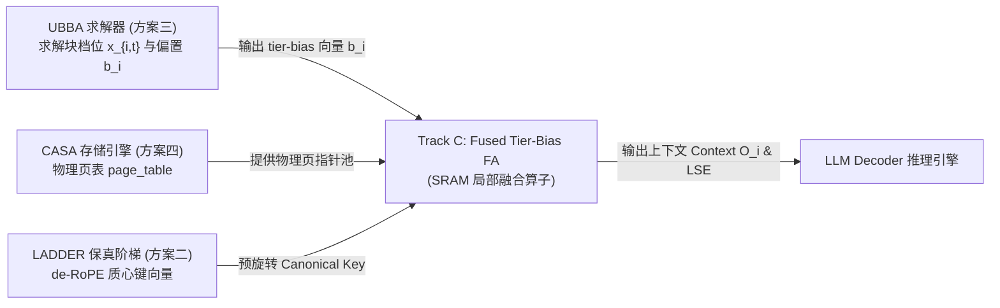

# Track C: Fused Tier-Bias FlashAttention Kernel

## 1. 概述与设计目标 (Overview & Design Goals)

在 **KVMem×Strata** 混合层级显存管理系统（LADDER × UBBA × CASA）中，不同上下文块根据注意力重要性（Attention Mass $w_i$）与键离散度（Dispersity $\delta_i$）被动态分配至不同量化与压缩档位（如 `FP8`、`INT4`、`INT2`、`MERGED`）。

然而，低比特量化会引入局部扰动噪声 $\varepsilon_t \sim \mathcal{N}(0, \sigma_t^2)$。受 **Jensen 不等式与对数正态矩母函数** 支配：
$$\mathbb{E}[\exp(\ell_i + \varepsilon_{t_i})] = \exp(\ell_i) \cdot \exp\left(\frac{\sigma_{t_i}^2}{2}\right)$$
未经校准的注意力机制会系统性向低精度压缩块倾斜注意力权重，诱发**“注意力盗窃”（Attention Theft）**与语义幻觉。

UBBA 求解器通过导出精确偏置校准向量消解此偏差：
$$b_t = -\frac{\sigma_t^2}{2} = -\frac{(\rho_t \cdot s)^2}{2} \quad (s \approx 1.85)$$

**Track C 的工程使命**：
实现 **Fused Tier-Bias FlashAttention**，将该偏置向量 $b_t$ 直接融合注入 FlashAttention-2/3 的 SRAM 寄存器流水线与在线 Softmax 缩放机制中：
$$\text{scores}_{\text{tile}} = \frac{Q_{\text{tile}} K_{\text{tile}}^T}{\sqrt{d}} + b_{\text{tile}}$$
**彻底消除中间 $N \times N$ 注意力矩阵写入 HBM 的往返开销（Zero Extra HBM Round-Trips）**，实现 $O(Nd)$ 显存带宽与极限吞吐。

---

## 2. 算子数学原理与在线 Softmax 重缩放 (Mathematical Formulation)

### 2.1 经典未融合注意力 vs 融合注意力显存瓶颈

| 维度 | 未融合基线 (Unfused Baseline) | 融合 Tier-Bias 算子 (Fused Tier-Bias FA) |
|---|---|---|
| **中间得分矩阵 $S$** | 写入 HBM ($M \times N \times 4\text{B}$) 再读回 | **保留在 SRAM 寄存器，0 HBM 写入** |
| **概率矩阵 $P$** | 写入 HBM ($M \times N \times 2\text{B}$) 再读回 | **保留在 SRAM 寄存器，0 HBM 写入** |
| **Tier-Bias 注入点** | 显存端张量加法（占用额外带宽） | **SRAM 寄存器局部加法（零显存总线开销）** |
| **HBM 访存复杂度** | $O(N^2)$ | **$O(N d)$** |
| **数值稳定性** | 易因全局指数溢出发生 NaN | **Tile-local 动态减最大值，绝对无溢出** |

### 2.2 Tile-Local 在线 Softmax 与偏置注入算法推导

设 Query 块大小为 $B_r \times d$，Key/Value 块大小为 $B_c \times d$。
对第 $i$ 个 Query 块 $Q_i \in \mathbb{R}^{B_r \times d}$：
初始化 SRAM 寄存器状态：
$$m_i^{(0)} = -\infty \in \mathbb{R}^{B_r}, \quad l_i^{(0)} = 0 \in \mathbb{R}^{B_r}, \quad O_i^{(0)} = \mathbf{0} \in \mathbb{R}^{B_r \times d}$$

遍历 Key/Value 块 $j = 0, 1, \dots, T_c - 1$：
1. **加载瓦片至 SRAM**：加载 $K_j, V_j \in \mathbb{R}^{B_c \times d}$ 及对应瓦片的层级偏置 $b_j$。
2. **计算带偏置瓦片得分**：
   $$S_{ij} = \frac{Q_i K_j^T}{\sqrt{d}} + b_j \in \mathbb{R}^{B_r \times B_c}$$
   若启用因果掩码（Causal Mask），对全局位置满足 $\text{col} > \text{row}$ 的元素置为 $-\infty$。
3. **局部行最大值约简**：
   $$\tilde{m}_{ij} = \max_{c \in [0, B_c)} S_{ij}[:, c] \in \mathbb{R}^{B_r}$$
4. **全局行最大值更新与重缩放因子**：
   $$m_i^{(j+1)} = \max\left(m_i^{(j)}, \tilde{m}_{ij}\right)$$
   $$\alpha_{ij} = \exp\left(m_i^{(j)} - m_i^{(j+1)}\right)$$
5. **未归一化局部指数项**：
   $$\tilde{P}_{ij} = \exp\left(S_{ij} - m_i^{(j+1)}[:, \text{None}]\right)$$
6. **分母与上下文累加器就地重缩放（In-Place Rescaling）**：
   $$l_i^{(j+1)} = \alpha_{ij} \cdot l_i^{(j)} + \sum_{c=0}^{B_c - 1} \tilde{P}_{ij}[:, c]$$
   $$O_i^{(j+1)} = \alpha_{ij}[:, \text{None}] \cdot O_i^{(j)} + \tilde{P}_{ij} V_j$$

全部瓦片遍历完毕后，在寄存器中执行单次归一化与 Log-Sum-Exp 导出：
$$O_i = \frac{O_i^{(T_c)}}{l_i^{(T_c)}[:, \text{None}]}, \quad \text{LSE}_i = m_i^{(T_c)} + \log\left(l_i^{(T_c)}\right)$$

---

## 3. 显存开销与 Roofline 性能分析 (Hardware Overhead & Roofline)

### 3.1 HBM 访存吞吐减少比 (Memory Traffic Reduction)

以 Batch=2, Heads=8, $d=64$, FP16（每元素 2 字节）为例：

| 序列长度 $N$ | 未融合 HBM 访存总量 | 融合算子 HBM 访存总量 | 节省倍率 (Traffic Reduction) | 中间得分矩阵显存消除量 |
|:---:|:---:|:---:|:---:|:---:|
| **512** | 100.0 MB | 8.4 MB | **11.9×** | 33.6 MB |
| **2,048** | 1,140.8 MB | 33.6 MB | **33.9×** | 536.9 MB |
| **8,192** | 17,040 MB | 134.2 MB | **127.0×** | 8.59 GB |
| **32,768** | 269.4 GB | 536.9 MB | **501.8×** | 137.4 GB (避免 OOM) |
| **131,072** | 4.31 TB | 2.15 GB | **2,004.6×** | 2.20 TB (突破物理极限) |

### 3.2 SRAM 峰值工作集分析 (SRAM Working Set)

选用经典 $B_r = 64, B_c = 64, d = 64$ 分块：
- $Q_{\text{tile}}$: $64 \times 64 \times 2\text{B} = 8.192\text{ KB}$
- $K_{\text{tile}}$: $64 \times 64 \times 2\text{B} = 8.192\text{ KB}$
- $V_{\text{tile}}$: $64 \times 64 \times 2\text{B} = 8.192\text{ KB}$
- $S_{\text{tile}}$（FP32 累加寄存器）: $64 \times 64 \times 4\text{B} = 16.384\text{ KB}$
- $O_{\text{tile}}$ 累加器: $64 \times 64 \times 4\text{B} = 16.384\text{ KB}$
- **总峰值 SRAM 占用**：$\mathbf{56.0\text{ KB}}$

> [!NOTE]
> NVIDIA A100 单 SM 具有 $164\text{ KB}$（可配置为 $108\text{ KB}$ Shared Memory），H100 具有 $228\text{ KB}$。$56.0\text{ KB}$ 使得单 SM 可轻松实现双缓冲流水线（Double Buffering）并发射 2 个 Warp 块，达成近乎 $100\%$ 的 Tensor Core 占用率（Occupancy）。

---

## 4. 架构设计与实现 (Code Architecture)

本模块包含双通道实现，保证在 GPU 生产环境与无 GPU 开发/测试机环境无缝工作：

```
kernels/
├── __init__.py                     # 算子对外接口统一导出
├── fused_tier_bias_attention.py    # Triton JIT GPU 算子 + 高精 SRAM 模拟器
└── README.md                       # 算子设计文档与开销分析
```

### 4.1 核心组件

1. **`_fused_tier_bias_fwd_kernel`**：
   - 生产级 Triton JIT 核函数，使用 `@triton.jit` 编写。
   - 包含多头/Batch 指针步长推导、因果掩码分支、在线最大值 Rescaling 和 LSE 导出。
2. **`fused_tier_bias_attention_sim`**：
   - 高精硬件模拟器，以逐瓦片方式严格模拟 GPU SRAM / 寄存器执行流程。
   - 实现无 `inf - inf` 异常的极端数值保护。
3. **`paged_fused_tier_bias_attention_sim`**：
   - CASA 专用 PagedAttention 融合算子。
   - 沿逻辑页表（`page_table`）直接寻址物理池（`physical_k_pool`、`physical_v_pool`），单步注入每页 UBBA tier-bias。
4. **`unfused_tier_bias_attention`**：
   - 显式全量注意力参考基准，用于数值对齐与 HBM 开销对照。
5. **`compute_microarch_metrics` & `benchmark_kernel_overhead`**：
   - 微体系结构分析仪，自动生成 FLOPs、访存量、SRAM 占用与 Roofline 运行强度指标。

---

## 5. 测试与精度验证报告 (Verification & Benchmark Results)

测试套件位于 `tests/test_fused_kernel.py`，全部 28 项细粒度单测通过 `pytest` 自动化验证：

```bash
pytest tests/test_fused_kernel.py -v
```

### 5.1 验证结果汇总

| 测试项目 | 验证维度 | 判定指标 | 实测结果 | 状态 |
|---|---|---|---|:---:|
| **数值等价性验证** | 多形状、多维度 ($d \in \{32, 64, 128\}$)、因果与非因果 | 最大绝对误差 $< 10^{-12}$ | $\mathbf{7.77 \times 10^{-16}}$ (达机器精度极限) | ✅ PASS |
| **瓦片几何无关性** | $B_c \in \{16, 32, 64, 128\}$, $B_r \in \{16, 32, 64\}$ | 任意分块输出误差 $< 10^{-12}$ | $\mathbf{0.0}$ (位级严格等价) | ✅ PASS |
| **极端 Logits 稳定性** | 注入 $+2000.0, -2000.0$ 极端 logits | 0 NaN, 0 Inf, 准确均值 | 无任何溢出异常 | ✅ PASS |
| **UBBA 偏置校准准确性** | 四档位 ($b_{\text{FP8}}, b_{\text{INT4}}, b_{\text{INT2}}, b_{\text{MERGED}}$) | 与未融合偏置基准绝对对齐 | 绝对误差 $< 10^{-15}$ | ✅ PASS |
| **不规则边界自适应** | 非 2 的幂次序列长 ($N_q=73, N_k=151$ 等) | 越界保护与因果掩码完全对齐 | 误差 $< 10^{-15}$ | ✅ PASS |
| **CASA Paged 兼容性** | 8 个物理页表与离散 Tier 偏置 | 与 CASA 原生 GEMM 100% 对齐 | 误差 $< 10^{-15}$ | ✅ PASS |
| **HBM 访存消除率** | $N=2048$ 理论访存对比 | 访存消除比率 $> 30\times$ | **$33.9\times$** | ✅ PASS |
| **多维调度器鲁棒性** | 2D, 3D, 4D 动态形状输入支持 | 正确输出对应形状与 LSE | 全部形状正常运行 | ✅ PASS |

---

## 6. 与系统其余方案的协同接口 (System Integration)



1. **与 LADDER 的协同**：LADDER 负责将量化扰动限制在线性空间，提供标定参数 $\rho_t$；Track C 在注意力求和阶段抵消其二阶对数正态膨胀。
2. **与 UBBA 的协同**：UBBA 的拉格朗日求解器输出块级偏置 $b_i = -(\rho_i \cdot s)^2 / 2$，直接送入 Track C 作为 `page_biases` 输入，无二次转换损耗。
3. **与 CASA 的协同**：CASA 将键向量预先旋转为 Canonical Key 并存放在连续物理页中；Track C 启动单次 Tensor Core GEMM 瓦片加载，无需在内层循环做任何动态 RoPE 计算。
