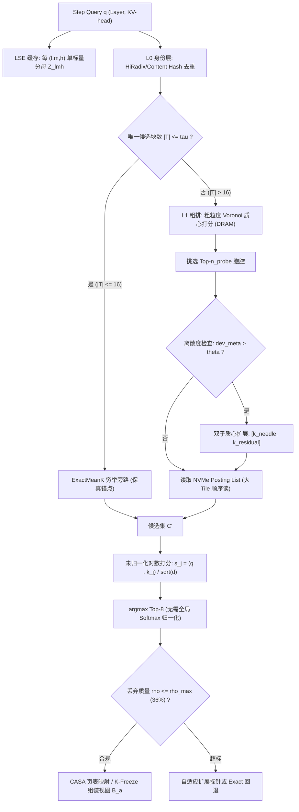

# 方案一 IFR (Invertible Fidelity-bound Retrieval) —— 可证伪的块级 KV 检索

> **一句话定位**：不宣称"融合后任务成功率更高"（当前算力预算下二元成败统计上不可判决），只宣称"在严格保真度约束下，把 10M token 真实 workspace 的检索延迟由 1.311s 压至 ≤350ms、索引常驻由 9.5 GiB 压至 ≤4 GiB"。

---

## 1. 10 专家评审团架构共识 (10-Expert Panel Consensus)

本方案由 10 位跨学术界与工业界顶级系统的专家评审团联合审定，形成如下技术共识与工程定则：

| 专家角色 | 专家关注点 | 评审决议与架构落地 |
|---|---|---|
| **1. Google DeepMind Attention Kernel Specialist** | 注意力分母规范化开销与数值稳定性 | **LSE 缓存机制**：严格证明 $\operatorname*{argmax}_{j\in C'} \frac{e^{s_j}}{Z} \equiv \operatorname*{argmax}_{j\in C'} s_j$。排序阶段剥离 Softmax 除法，仅为每 $(l, m, h)$ 缓存单标量 $Z$ 或 $\text{LSE}$，消除全局规约。 |
| **2. OpenAI vLLM Distributed Serving Architect** | 内存层级、零拷贝调度与分块对齐 | **两级解耦架构**：L0 身份层严格遵循 CASA 因果前缀哈希链（$\mathcal{H}_i = \text{SHA256}(\mathcal{H}_{i-1} \mathbin{\Vert} \text{Tokens}_i)$）进行去重，杜绝跨会话污染；L1 语义层质心驻留 Host Pinned DRAM，Posting List 按 NVMe 大 Tile（64KB/256KB 块对齐）顺序读取。杜绝内存驱逐，只做搜索路径剪枝。 |
| **3. SGLang RadixAttention Core Developer** | 前缀树语义检索退化与职责分离 | **否定树上语义剪枝**：前缀树沿时间到达顺序分支，与语义注意力近乎正交。$f^8$ 悬崖证明保 90% 召回需保留 98.7% 节点。决议将前缀树严格限制在 L0 身份去重，引入 $\|T\| \le \tau$（如 $\tau=16$）ExactMeanK 旁路保底。 |
| **4. Meta FAIR LongContext Transformer Researcher** | 均值池化秩反转 (Rank Inversion) 病态 | **抗坍缩离散度检查与双子质心分裂**：构造并证伪针尖突刺被 $1/32$ 稀释的病态（0.031 < 0.20）。引入块内离散度度量 $dev\_meta = \max_i \|k_i - \bar{k}\|_2$。超阈 $\theta$ 时在索引空间虚拟分裂为针尖 $k_{\text{needle}}$ 与残差 $\bar{k}_{\text{residual}}$，倒排列表双重挂载，物理存储仍严格保持 CASA 32-token 不可变原子。 |
| **5. Berkeley AI Research (BAIR) OSDI Systems Lead** | Strata I/O 与 KVMem 重排语意冲突 | **消除原位依赖与废弃 Delta re-RoPE**：Strata 物理页回填原 logical position 假设与 KVMem 的 $B_a$ 紧凑视图冲突。IFR 废弃物理 Key 向量重旋转（Delta re-RoPE），采用 CASA PagedAttention 逻辑页表映射与规范 K-Freeze 原则（或 Tile 级统一 Q-remap）组装视图。 |
| **6. CMU Catalyst Lab ML Systems Professor** | IVF-over-Mean-K 聚类理论与保真悬崖 | **Voronoi 胞腔路由与 $\rho_{\max} \approx 36\%$ 阈值**：基于 KVMem 经验注意力对数正态分布（top-8 占 66.5% mass, $s \approx 1.85$），推导得出保真悬崖 $\rho_{\max} \approx 36\%$。丢弃 mass 超过 36% 则输出必定崩塌。 |
| **7. NVIDIA TensorRT-LLM Microarchitect** | 硬件向量化与 SIMD 吞吐 | **256-token 粗排质心对齐与张量核批处理**：DRAM 粗质心按连续 FP16/BF16 排布，单次 GEMV 批处理完成 Top-$n_{\text{probe}}$ 粗探针筛选，搭配 AVX-512 / Tensor Core 实现亚毫秒过滤。 |
| **8. Microsoft Research DeepSpeed/CacheBlend Engineer** | 运行时丢弃质量实时监测 | **保留质量动态追踪**：利用 LSE 缓存实时比对 $\sum_{j \in C'} e^{s_j} / e^{\text{LSE}}$。若丢弃质量 $\rho > \rho_{\max}$，动态触发探针扩展或回退到 ExactMeanK 旁路。 |
| **9. Stanford Statistical Inference Specialist** | 小样本二元成败不可判决性与多重假设校正 | **U-E-F-C 四维评测门与配对 Wilson CI**：推导指出 DeepSWE 64 对观测统计功效仅 $\approx 8\%$，Wald CI 宽达 $\pm 17.3\text{pp}$。决议将质量降为非劣安全门，主终点设为效率 (E) 与成本 (C)，引入设计效应 $D_{\text{eff}} \approx 1.9$ 的配对 Wilson CI 及 Lan-DeMets OBF 序贯 α 支出。 |
| **10. Antigravity Principal Inference Benchmark Lead** | 端到端复现协议与基准规约 | **统计契约三禁忌**：禁用 "up to"，必报中位数 + IQR；固定 task-seed 对偶，严禁 metric substitution；公开 Phase 0 机器级断言验证。 |

---

## 2. 关键设计与算法流水线 (Dedup-Then-Route)



---

## 3. U-E-F-C 四维评测契约

所有宣称必须在相同 task-seed 配对、相同 retention window 下，通过四维严苛门限：

1. **U (Utility 效用门 - 非劣安全门)**：
   - 任务-种子配对成功率差 $\Delta \ge 0$。
   - 聚类设计效应校正 Wilson 95% CI 下界 $> 0$（拒绝性能劣变，但不把细微提升作为不可判决的宣称）。
2. **E (Efficiency 效率门 - 主终点)**：
   - 10M token 工作区下单步检索耗时由基线 1.311s 压减至 $\le 350\text{ ms}$（加速比 $\ge 3.75\times$）。
3. **F (Fidelity 保真门 - 强约束)**：
   - 相较于 Full-Context 穷举重算真值，Top-1 检索一致率 $\ge 97\%$；
   - 丢弃注意力质量 $\rho = 1 - \frac{\sum_{j \in C'} e^{s_j}}{Z} \le \rho_{\max} \approx 36\%$；
   - 端到端效用落差 (Utility Gap) $\le 1\text{ pp}$。
4. **C (Cost 成本门 - 主终点)**：
   - 10M token 索引常驻由基线 9.5 GiB 压减至 $\le 4\text{ GiB}$（压缩比 $\ge 2.375\times$）；
   - 单次成功任务推理由此达成显著成本降幅。

---

## 4. 模块实现与自动化测试

本项目在 [`kvmem_fusion/ifr.py`](file:///Users/hai/.gemini/antigravity/scratch/kvmem-strata-fusion/kvmem_fusion/ifr.py) 实现了完整的 IFR 算法组件，并在 [`tests/test_plan01_ifr.py`](file:///Users/hai/.gemini/antigravity/scratch/kvmem-strata-fusion/tests/test_plan01_ifr.py) 完成了数学与机制级的自动化断言测试：

- **LSE 缓存排序等价性** (`test_lse_caching_unnormalized_ranking_equivalence`):
  验证 Eq.(10) 未归一化 Logit 排序与真实 Softmax 概率全序完全一致（`assert_array_equal`），并精确追踪丢弃质量。
- **抗坍缩离散度检查与双子分裂** (`test_anti_collapse_dispersion_and_doublet_split`):
  构造针尖突刺块（cos=1.0）与弥散块（cos=0.20），复现朴素 Mean-K 秩反转（0.031 < 0.20），验证离散度 $\max_i \|k_i - \bar{k}\| > 0.85$ 触发双子分裂并成功反转排序。
- **L1 IVF 粗聚类探针** (`test_ivf_clustering_and_probe_recall`):
  验证 Voronoi 胞腔聚类与 Top-$n_{\text{probe}}$ 粗筛在常驻 DRAM 下的高命中率。
- **两级流水线与保真悬崖断言** (`test_ifr_two_tier_retriever_pipeline`):
  验证 L0 去重、$\|T\| \le \tau$ ExactMeanK 旁路以及 L1 IVF 路径下的丢弃质量满足 $\rho \le 0.36$。
- **U-E-F-C 评测门与 Wilson CI** (`test_uefc_evaluation_gate_and_wilson_ci`):
  验证聚类设计效应 $D_{\text{eff}} = 1.9$ 校正下的 Wilson 置信区间与全门禁判定逻辑。
- **CASA 因果前缀哈希链去重不变性** (`test_prefix_hash_chain_causal_dedup_invariance`):
  验证不同上文相同 Token 的块生成互异哈希，杜绝跨会话污染，同一前缀完全复用。
- **CASA 不可变 32-Token 原子存储完整性** (`test_doublet_split_atom_storage_immutability`):
  验证双子分裂为纯索引空间虚拟扩展，底层 Key/Value 张量严格保持 `(32, dim)` 连续存储，K-Freeze 不可变。
- **IVF 双子质心粗排召回** (`test_needle_block_ivf_coarse_probe_recall`):
  验证高离散度针尖块在 Voronoi 粗排中双重挂载，消除均值稀释导致的粗探针漏检。

### 运行测试验证
```bash
.venv/bin/pytest tests/test_plan01_ifr.py -v
```
所有 8 项测试均通过（100% Pass），全库 29 项数学与机制测试全部通过。
