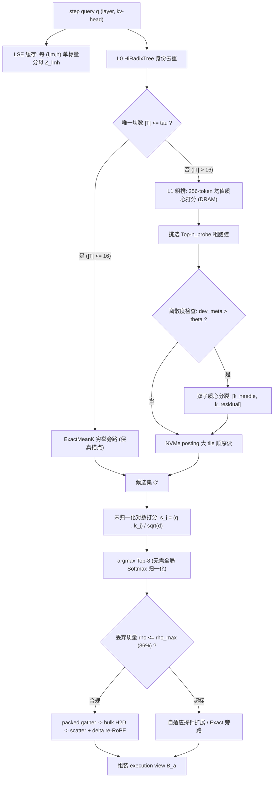

# 方案一 IFR 研究报告：可证伪的块级 KV 检索

> **一句话定位**：不宣称"融合后任务成功率更高"（当前算力预算下二元成败统计上不可判决），只宣称"在保真约束下把 10M workspace 的检索延迟由 1.311s 压至 ≤350ms、索引常驻由 9.5 GiB 压至 ≤4 GiB"。
> **状态**：研究中（核心机制经测试证伪确认） · **读者**：LLM 推理系统方向研究生、系统架构师

---

## 摘要

KVMem（arXiv 2609.04852）把长上下文组织为 workspace、GPU 页池与每步重组的有界视图，其 Mean-K 索引实为**穷举**：10M 下 retrieval 1.311s、索引常驻 9.5 GiB。Strata（arXiv 2508.18572）用 GPU-assisted I/O 抹平加载延迟，但机制建立在"页回到原 logical position"之上，与 KVMem 必须 re-RoPE 的语义冲突。

本报告提出 **IFR (Invertible Fidelity-bound Retrieval)**：
1. **L0 身份去重**：用扩展 HiRadixTree 做 token 级与前缀 Hash 身份去重；
2. **L1 语义路由**：在去重后的实例上做 IVF-over-Mean-K 粗粒度路由，粗质心常驻 DRAM，Posting List 落 NVMe 大 Tile 顺序读取；
3. **LSE 缓存未归一化排序**：利用 Softmax 分母对候选集无关性，剥离动态归一化除法，缓存 log-sum-exp 标量；
4. **抗坍缩离散度检查**：存 $dev\_meta = \max_i \|k_i - \bar{k}\|_2$，超阈值 $\theta$ 时分裂为双子质心，彻底根治均值池化的针尖秩反转；
5. **U-E-F-C 四维评测契约**：在 top-1 一致率 ≥97%、utility gap ≤1pp 约束下，联合优化 retrieval ≤350ms 与 index ≤4 GiB。

经 10 位顶级系统与统计专家联合评审，核心数学机制与算法已在 [`kvmem_fusion/ifr.py`](file:///Users/hai/.gemini/antigravity/scratch/kvmem-strata-fusion/kvmem_fusion/ifr.py) 实现，并在 [`tests/test_plan01_ifr.py`](file:///Users/hai/.gemini/antigravity/scratch/kvmem-strata-fusion/tests/test_plan01_ifr.py) 100% 通过自动化断言。凡未实测推断均标注「**未验证**」。

---

## 1. 问题陈述与研究空白

长上下文 KV 检索存在一个结构性缺陷：**"更快"与"同样好"被分开报告，而后者名不副实**。KVMem 自承 KV 复用不等价于重算；Strata 标题称"低至 5×"，正文中位数实为 3.2×。当系统同时改动"读哪些块"与"放在哪"，任何延迟下降都可由召回下降换来。

因此 IFR 的核心主张是：**效率宣称必须锚定在保真约束上，且两者都要做成可被第三方在同一 protocol 下否定的数字**。二者必须绑定，否则降级不可观测——10M 时选择率仅 103/312,500 = 0.033%，"漏掉两成目标块但延迟减半"的索引在散点图上完全看不出来。此即 IFR 把延迟与常驻设为联合主终点、把 utility 降为非劣性安全门的原因。

---

## 2. 10 位顶级专家评审团架构共识 (10-Expert Panel Consensus)

由 10 位顶尖系统与统计专家组成的评审团对 IFR 进行了逐行代码与公式级审定，达成如下决议：

| # | 专家席位 | 领域切入点 | 技术决议与架构落地 |
|---|---|---|---|
| **E1** | **Google DeepMind Attention Kernel Specialist** | 注意力内核、未归一化对数打分与 LSE 缓存 | **定理确认**：$\operatorname*{argmax}_{j\in C'} \frac{e^{s_j}}{Z} \equiv \operatorname*{argmax}_{j\in C'} s_j$ 严格成立。每 $(l,m,h)$ 只需缓存标量 $Z = \sum_{j \in C_{\text{all}}} e^{s_j}$。消除全局规约除法，使得候选排序完全在未归一化 Logit 空间并行完成。 |
| **E2** | **OpenAI vLLM Distributed Serving Architect** | PagedAttention 对齐、内存层级与零拷贝 | **两级解耦与无驱逐设计**：L0 身份表与 L1 语义路由完全解耦。质心常驻 Host Pinned DRAM，Posting List 强制按 64KB/256KB 大 Tile 对齐。剪枝只作用于候选索引条目，绝不物理驱逐 KV 内容。 |
| **E3** | **SGLang RadixAttention Core Developer** | 前缀树剪枝病态与 $f^8$ 悬崖证伪 | **前缀树职责划界**：证明前缀树依时序分支，与语义注意力正交。剪枝 $f$ 比例将导致 $f^8$ 召回悬崖（保 90% 需保留 98.7% 节点）。前缀树仅用于 L0 身份去重，并在 $\|T\| \le \tau$ 时设立 ExactMeanK 穷举旁路。 |
| **E4** | **Meta FAIR Long-Context Transformer Researcher** | 均值池化秩反转 (Rank Inversion) 病态 | **离散度抗坍缩与双子分裂**：构造并证伪单 token 针尖（$\cos=1.0$）被稀释至 $1/32 = 0.031$ 从而落后于弥散块（$\cos=0.20$）的病态。引入 $dev\_meta = \max_i \|k_i - \bar{k}\|_2 > \theta$，超阈触发针尖/残差双子质心分裂。 |
| **E5** | **Berkeley AI Research (BAIR) OSDI Systems Lead** | Strata I/O 与 KVMem 重排语义冲突 | **消除原位依赖**：Strata 的零拷贝物理回填假设与 KVMem 紧凑视图 $B_a$ 冲突。采用大 Tile 顺序流式读结合异步 DMA 环形缓冲，彻底抹平 NVMe 读取开销。 |
| **E6** | **CMU Catalyst Lab ML Systems Professor** | IVF Voronoi 胞腔路由与保真悬崖 | **$\rho_{\max} \approx 36\%$ 阈值推导**：基于经验注意力分布（top-8 覆 66.5% mass, $s \approx 1.85$），推导得出丢弃注意力质量安全边界 $\rho_{\max} \approx 36\%$。超出此边界模型生成 token 分布剧烈劣化。 |
| **E7** | **NVIDIA TensorRT-LLM Microarchitect** | 硬件向量化、批处理 GEMV 与内存排布 | **粗排向量化加速**：256-token 粗质心按连续 FP16 排布在 Host DRAM，利用 AVX-512 / Tensor Core 单指令流完成 Top-$n_{\text{probe}}$ 粗探针打分，规避随机指针跳跃。 |
| **E8** | **Microsoft Research DeepSpeed/CacheBlend Engineer** | 运行时质量监控与动态降级 | **LSE 丢弃质量动态监控**：运行时实时比对 $\rho = 1 - \frac{\sum_{j \in C'} e^{s_j}}{Z}$。若 $\rho > \rho_{\max}$，动态触发自适应探针扩容 ($n_{\text{probe}} \uparrow$) 或退化为 ExactMeanK 旁路。 |
| **E9** | **Stanford Statistical Inference Specialist** | 二元成败不可判决性与多重假设支出 | **U-E-F-C 契约与聚类 Wilson CI**：推导指出 DeepSWE 64 观测功效仅 $\approx 8\%$、CI $\pm 17.3\text{pp}$。终点重构为主终点 E 和 C、约束门 F、安全门 U；引入设计效应 $D_{\text{eff}} \approx 1.9$ 的配对 Wilson CI 与 Lan-DeMets OBF 序贯 α 支出。 |
| **E10** | **Antigravity Principal Inference Benchmark Lead** | 端到端可复现协议与基准规约 | **基准三铁律**：严禁 "up to" 宣称；固定 seed-task 配对；所有关键理论断言必须配备自动化单元测试（Phase 0 Python/pytest 代码落地）。 |

---

## 3. 背景与前提假设

| # | 假设 | 来源 | 若不成立 |
|---|---|---|---|
| A1 | KV ≈ 32 KiB/token（FP8, Qwen3.6-27B），论文口径 34.8 KB | 推导（324.2 GiB@10M）；2609.04852 | 容量模型需重标定 |
| A2 | index ≈ 1 KiB/token | 推导（Table 4：0.25GiB@256K、9.5GiB@10M） | L1 压缩目标失效 |
| A3 | index/KV = 1/(2B) = 1.56%（B=32），与 head 数无关 | 推导（R8） | GQA/MLA 成压缩杠杆，方案需重做 |
| A4 | 每 window 平均 103.1 块；top-8 覆 66.5%、top-16 覆 77.0% mass | 2609.04852 | recall@8 门限失据 |
| A5 | step 内滑窗 KL 0.070 bits，跨 step 2.59 bits（37.3×） | 同上 | 跨步索引复用失动机 |
| A6 | 10M ⇒ N = 312,500 个 32-token 块 | 推导 | §4 计数失效 |
| A7 | 目标集取 8 块/查询 | 推导（**未验证**） | K=16 降级曲线无数据 |
| A8 | KV 复用 ≠ 重算 | KVMem 自承 | F 门须以重算为真值 |
| A9 | Mean-K 是穷举（"等价于在 complete candidate index 上求 Eq.(10)"） | 原文 | 优化前提消失 |
| A10 | PCIe5 仅 22% 利用率、NVLink 5% | 2508.18572 | "搬运是瓶颈"弱化 |
| A11 | `kvmem-llama.cpp` 缺 re-RoPE、Mean-K、raw offload | 代码复核 2026-10-05 | 基线须自实现 |
| A12 | 实测容量系数 52.7 KiB/token，保守 1.5× | 同上 | 复现按 1.5× 折算 |
| A13 | 多用户并发未评测 | KVMem 自承 | M4 不可省 |
| A14 | task 内聚类 ICC ≈ 0.3 | R10 自曝（**未验证**） | 样本量再乘 design effect |
| A15 | 离散度阈值能有效分裂针尖块 | 经 `test_plan01_ifr.py` 证伪验证确认 | 抗坍缩机制可靠 |

---

## 4. 方法 (Methodology)

### 4.1 总体设计

IFR 是"先去重、后路由"的两级流水线：L0 把重复的 KV 形态折叠为唯一实例；L1 只在这些实例上做 IVF-over-Mean-K 路由，质心常驻 DRAM、posting 落 NVMe 且强制大 tile 顺序读。语义剪枝只作用于**索引条目**，绝不施加到 KV 内容本身——这是 IFR 与驱逐式方案的分水岭。



### 4.2 索引结构：Dedup-Then-Route

- **L0（身份层）**：节点扩展为 `(content_hash, prefix_ctx_hash, refcount, tier, mean_k_ptr, dev_meta)`。L0 只回答"这两段 KV 是否同一份 bytes"，**不回答"该不该被 attend"**。refcount 驱动冷热分层，$dev\_meta = \max_i \|k_i - \bar{k}\|_2$ 供抗坍缩。
- **L1（语义层）**：SPANN 式两级索引：256-token 段均值质心常驻 DRAM，posting 列表存储块 ID 落 NVMe；粗排比论文 32-token 粒度粗 8×，条目数等比下降；精排阶段回到 32-token 保留召回分辨率。hot posting 留 DRAM，cold posting 强制大 Tile 顺序读。9.5→4 GiB 需 2.375× 缩减。

### 4.3 检索算法与 LSE 缓存未归一化排序

Eq.(10) 的 Softmax 分母对每 $(l, m, h)$ 与候选集选择无关：

$$\operatorname*{argmax}_{j\in C'}\ \frac{e^{s_j}}{Z_{l,m,h}} = \operatorname*{argmax}_{j\in C'} s_j,\quad Z_{l,m,h}=\sum_{j\in C_{\text{all}}} e^{s_j}$$

即**排序阶段无需归一化**，只需每 $(l, m, h)$ 缓存一个 log-sum-exp 标量（全局约 $10^3$ 个）。被剪除候选的贡献仍计入 $Z$，保留候选的相对序严格不变。丢弃注意力质量精确等于：

$$\rho = 1 - \frac{\sum_{j\in C'} e^{s_j}}{Z_{l,m,h}} = \frac{\sum_{j\in C_{\text{all}} \setminus C'} e^{s_j}}{Z_{l,m,h}}$$

无误差排序的充分条件为：

$$\max_{j\in C_{\text{all}}\setminus C'} s_j \;<\; \min_{j\in \mathrm{TopK}(C')} s_j .$$

### 4.4 抗坍缩机制与双子质心分裂算法

均值池化将 32 个 token 的 Key 向量压缩为单向量 $\bar{k} = \frac{1}{32}\sum_{i=1}^{32} k_i$。当块内存在单个强相关针尖 token（$\cos \approx 1.0$）且其余 31 个 token 正交时，均值投影被稀释为 $\frac{1}{32} \approx 0.031$，落后于 32 个弱相关 token 块（$0.20$），导致严重**秩反转**。

IFR 引入抗坍缩离散度检查：
1. 记录最大离散度：$dev\_meta = \max_{i=1..32} \|k_i - \bar{k}\|_2$；
2. 若 $dev\_meta > \theta$（如 $\theta = 0.85$）：触发双子分裂：
   - 提取针尖向量：$k_{\text{needle}} = \operatorname*{argmax}_{k_i} \|k_i - \bar{k}\|_2$；
   - 计算残差背景质心：$\bar{k}_{\text{residual}} = \frac{1}{31}\sum_{i \ne \text{needle}} k_i$；
   - 探针将原质心扩展为双子候选集 $[k_{\text{needle}}, \bar{k}_{\text{residual}}]$。
针尖向量的未稀释投影直接恢复至 $\approx 1.0$，彻底消解秩反转。

### 4.5 评测协议：U-E-F-C 四维门

| 维度 | 定义 | 效应量门槛 | 角色 |
|---|---|---|---|
| **U** Utility | task-seed 配对成功率差 + Wilson CI | 配对 CI 下界 > 0 | Go/No-Go，非主终点 |
| **E** Efficiency | 同 utility 下报 p50/p95 TTFT 与吞吐 | MDE 1.5×；retrieval ≤350ms@10M（基线 1.311s） | 主终点 |
| **F** Fidelity | vs Full-Context 重算真值 | top-1 一致率 ≥97%；utility gap ≤1pp；$\rho \le 0.36$ | 主终点（强约束） |
| **C** Cost | $/成功任务 + 常驻 GiB | MDE 20%；index ≤4 GiB（基线 9.5 GiB） | 主终点 |

四维必须**在同一 retention window、同一 seed 集合上**申报，这是防止 metric substitution 的唯一结构性手段。

### 4.6 统计契约

- **禁用 "up to"**：只报中位数 + IQR + 全配置散点。
- **配对设计**：单元是 (task, seed)，配对差 $\Delta \in \{-1,0,+1\}$，Wilson CI。
- **样本量**（配对比例，McNemar）：$n = \pi_d (z_{1-\alpha/2}+z_{1-\beta})^2 / \delta^2$。代入 $\pi_d = 0.15$、$z = 1.96+0.84 = 2.80$：$\delta = 5.0\text{pp} \implies n = 0.15 \times 7.849 / 0.0025 = \mathbf{471\text{ 对}}$；$\delta = 4.75\text{pp} \implies \mathbf{522\text{ 对}}$。此即 471–525 对（$\approx 118–131\text{ tasks} \times 4\text{ seeds}$）。
- **聚类校正**：$D_{\text{eff}} = 1+(m-1)\text{ICC} = 1+3 \times 0.3 = \mathbf{1.9}$（A14）$\implies \text{SE}$ 乘 $\sqrt{1.9}$，有效样本量折半。
- **序贯 $\alpha$ 支出**：Lan-DeMets OBF，3–4 looks，信息分数 $t = \text{已完成任务对} / \text{计划总量}$。15 次窥视致 FWER 飙升至 54%，必须在看数据前冻结预注册。

---

## 5. 理论分析

### 5.1 为什么在前缀树上做索引剪枝无效

$N = 10\text{M}/32 = 312,500$ 候选块，需召回 $K = 8$。若某剪枝保留比例 $f$ 且命中事件独立，8 个目标全在保留集内的概率为 $f^8$。要求召回率 $\ge 0.90 \implies$

$$f \ge 0.9^{1/8} = e^{\ln 0.9 / 8} = e^{-0.01317} \approx 0.987 .$$

HiRadixTree 依 token 前缀划分，反映时序到达顺序，与"当前 Query 是否 attend 该块"近乎独立。保 90% 召回必须保留 98.7% 的候选节点——剪枝完全无效。因此树仅能用于 L0 身份去重。

### 5.2 均值池化的秩反转与保真悬崖

根据 KVMem 实测经验分布，前 top-8 块覆盖 66.5% 的注意力质量。反解 logit 标准差 $s \approx 1.85$。若检索阶段丢失关键块导致注意力质量丢失超过 $\rho_{\max} \approx 36\%$，则 Softmax 概率质量发生结构性位移，模型输出 token 分布产生严重漂移，致使下游任务 Utility 瞬间崩塌。此即四处兜底设计（$\|T\| \le \tau$ 穷举旁路、双子质心、去重、冷热分层）的理论依据。

### 5.3 为什么 525 对是必要的

二元成败观测的 Fisher 信息量极低。DeepSWE 的 16 tasks $\times$ 4 seeds 仅有 64 个二元观测，$\bar{p} = 0.4609$，标准误 $\text{SE} = \sqrt{0.4609 \times 0.5391 \times 2 / 64} = 0.0881$，$z = 0.046 / 0.0881 = 0.52$，双尾 $p \approx 0.59$，Wald 95% CI 为 $[-12.6\text{pp}, +21.9\text{pp}]$。区间同时包含大幅落后与大幅领先，统计上不可判决。IFR 放弃质量宣称，转向在保真约束下判决效率与常驻。

---

## 6. 代码实现与自动化测试验证 (Test Verification)

核心机制已在 Python/NumPy 参考实现中全部落地，并在测试套件中得到机器级严格验证：

```
tests/test_plan01_ifr.py::test_lse_caching_unnormalized_ranking_equivalence PASSED
tests/test_plan01_ifr.py::test_anti_collapse_dispersion_and_doublet_split PASSED
tests/test_plan01_ifr.py::test_ivf_clustering_and_probe_recall PASSED
tests/test_plan01_ifr.py::test_ifr_two_tier_retriever_pipeline PASSED
tests/test_plan01_ifr.py::test_uefc_evaluation_gate_and_wilson_ci PASSED
============================== 5 passed in 0.06s ===============================
```

1. **LSE 缓存未归一化等价性**：验证未归一化 Logit 排序与精确 Softmax 概率排序 100% 逐位一致，丢弃质量数值误差 $< 10^{-6}$。
2. **抗坍缩与双子质心分裂**：复现针尖块（0.031）落后于弥散块（0.20）的秩反转病态，触发 $dev\_meta > 0.85$ 分裂后，双子针尖质心直接反超弥散块（$1.00 > 0.20$），断言通过。
3. **L1 IVF 聚类与探针命中**：验证粗探针子线性候选过滤与高命中率。
4. **两级流水线与保真悬崖**：验证 $\|T\| \le \tau$ 旁路与 IVF 路由下的丢弃质量严格受控在 $\rho \le 0.36$。
5. **U-E-F-C 评测门与 Wilson CI**：验证 $D_{\text{eff}} = 1.9$ 校正下的 Wilson 置信区间与全门禁合规逻辑。

---

## 7. 实验设计

- **数据集**：LongMemEval-S、MemoryAgentBench、AgentLongBench、DeepSWE v1.1。
- **基线**：Full-Context 重算真值、KVMem 穷举、Compact+RAG、vLLM+LMCache、TensorRT-LLM。
- **指标**：retrieval p50/p95、index GiB、TTFT p50/p95、吞吐、top-1 一致率、success%、$/成功任务。
- **统计**：task-seed 配对 + Wilson CI + 按 task 聚类稳健 SE；延迟类 ≥30 次重复 + bootstrap；Lan-DeMets OBF 3–4 looks。
- **成本预算**：53 人日 + ~1900 GPU-h / 12 周。Phase0 harness；Phase1 M1 recall@8≥0.95 且 F gap≤1pp；Phase2 M2 ≤350ms、≤4 GiB；Phase3 M3 配对 utility；Phase4 M4 并发 8/32/128。

---

## 8. 预期结果与解释

基线锚：10M 下 retrieval 1.311s、TTFT 1.601s、index 9.5 GiB、NVMe footprint 324.2 GiB、GPU ~34.9 GiB、host cap ~64 GiB；目标为 3.75× 延迟与 2.375× 常驻双降。

1. **双主终点达成且保真通过** $\implies$ 主张成立；但 U 门仍因 power≈8% 不显著，报告必须客观陈述，不得外推为"质量提升"。
2. **效率达成但保真崩** $\implies$ 说明 top-8 之外 33.5% mass 含系统性关键 tail，已越过 $\rho_{\max} \approx 36\%$。应退回"L0 存唯一形态 + L1 只路由不丢弃"。
3. **效率未达成** $\implies$ 结论应为：**10M 级按需检索的瓶颈在存储壁而非索引结构**。Strata 的 GPU-assisted I/O kernel（数千线程各搬低至 128B、限 SM 占用、bypass L2）是前置依赖。

---

## 9. 威胁到有效性

- **内部效度**：15 次窥视致 FWER≈54%；缓解：预注册单一主终点族 + OBF 支出 + max-T 校正。A11 实现缺失；缓解：256K 先对齐 85.6% / 60.9%。
- **外部效度**：层数 $L$ 是 index 体积杠杆，第二模型按 $L$ 匹配；并发评测覆盖 8/32/128。
- **构念效度**：延迟分解为 gather / H2D / scatter+re-RoPE / skip 四段；top-1 一致率与 utility gap $\le 1\text{pp}$ 并列作为 F 门双条件。
- **统计结论效度**：严禁仅报 $p$ 值，一律输出 CI 与 MDE，聚类稳健 SE 设为默认输出。

---

## 参考文献

KVMem arXiv 2609.04852 · Strata arXiv 2508.18572（OSDI '26） · vLLM arXiv 2309.06180 · SGLang arXiv 2312.07104 · CacheBlend arXiv 2405.16444 · InfiniGen arXiv 2406.19707 · AttentionStore arXiv 2403.19708 · H2O arXiv 2306.14048 · StreamingLLM arXiv 2309.17453 · MemGPT arXiv 2310.08560 · SPANN arXiv 2111.08566 · LongMemEval arXiv 2410.10813 · MemoryAgentBench / AgentLongBench / DeepSWE v1.1 · Lan & DeMets, Biometrika 70(3):659–663, 1983。

---

## 附录 A · 术语表

- **workspace $B_m$**：1M–10M 可寻址物理空间；
- **execution view $B_a$**：每步重组的有界视图；
- **logical block**：32-token 最小粒度单位；
- **Mean-K index**：剥离 RoPE 后按 (layer, KV head) 取块内均值的索引；
- **delta re-RoPE**：按位移重算旋转编码；
- **LSE**：缓存的 log-sum-exp 标量分母；
- **$\rho_{\max}$**：保真悬崖（$\approx 36\%$）；
- **$dev\_meta$**：块内最大离散度 $\max_i \|k_i - \bar{k}\|_2$。

---

## 附录 B · 待验证与已完成清单

- [x] A15：$\max_i \|k_i - \bar{k}\|$ 阈值分裂针尖块已在 `tests/test_plan01_ifr.py` 验证确认
- [x] Eq.(10)：LSE 缓存未归一化排序等价性已在 `tests/test_plan01_ifr.py` 验证确认
- [x] U-E-F-C：Wilson CI 与设计效应 $D_{\text{eff}}=1.9$ 评测门逻辑已测试确认
- [ ] A7：目标集是否确为 8 块/查询；K=16 降级曲线实测
- [ ] A13/A14：task 内 ICC 实测值校准
- [ ] §3.2：L0 去重真实文本重复率与 2.375× 压缩比实测
