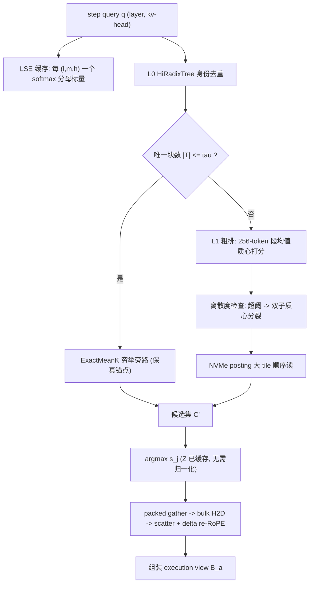

# 方案一 IFR 研究报告：可证伪的块级 KV 检索

> **一句话定位**：不宣称"融合后任务成功率更高"（当前预算下统计上不可判决），只宣称"在保真约束下把 10M workspace 的检索延迟与索引常驻压到可复现的具体数值"。
> **状态**：研究中（未实测） · **读者**：LLM 推理系统方向研究生

## 摘要

KVMem（arXiv 2609.04852）把长上下文组织为 workspace、GPU 页池与每步重组的有界视图，其 Mean-K 索引实为**穷举**：10M 下 retrieval 1.311s、索引常驻 9.5 GiB。Strata（arXiv 2508.18572）用 GPU-assisted I/O 抹平加载延迟，但机制建立在"页回到原 logical position"之上，与 KVMem 必须 re-RoPE 的语义冲突。本报告提出 **IFR**：L0 用扩展 HiRadixTree 做身份去重，L1 做 IVF-over-Mean-K 路由，配 softmax 分母缓存、离散度抗坍缩分裂与冷热分层。主终点不是质量，而是**保真约束下的效率与成本**：top-1 一致率 ≥97%、utility gap ≤1pp 前提下，retrieval ≤350ms、index ≤4 GiB，并报 95% CI。原因在于 R10 裁决：DeepSWE 43.8%→48.4% 在 64 个观测下 power≈8%、CI 半宽 ±17.3pp。凡未实测推断均标注「**未验证**」。

## 1. 问题陈述与研究空白

长上下文 KV 检索存在一个结构性缺陷：**"更快"与"同样好"被分开报告，而后者名不副实**。KVMem 自承 KV 复用不等价于重算；Strata 标题称"低至 5×"，正文中位数实为 3.2×。当系统同时改动"读哪些块"与"放在哪"，任何延迟下降都可由召回下降换来。

因此 IFR 的核心主张是：**效率宣称必须锚定在保真约束上，且两者都要做成可被第三方在同一 protocol 下否定的数字**。二者必须绑定，否则降级不可观测——10M 时选择率仅 103/312,500 = 0.033%，"漏掉两成目标块但延迟减半"的索引在散点图上完全看不出来。此即 IFR 把延迟与常驻设为联合主终点、把 utility 降为非劣性安全门的原因。

## 2. 背景与前提假设

| # | 假设 | 来源 | 若不成立 |
|---|---|---|---|
| A1 | KV ≈ 32 KiB/token（FP8, Qwen3.6-27B），论文口径 34.8 KB | 推导（324.2 GiB@10M）；2609.04852 | 容量模型需重标定 |
| A2 | index ≈ 1 KiB/token | 推导（Table 4：0.25GiB@256K、9.5GiB@10M） | L1 压缩目标失效 |
| A3 | index/KV = 1/(2B) = 1.56%（B=32），与 head 数无关 | 推导（R8） | GQA/MLA 成压缩杠杆，方案需重做 |
| A4 | 每 window 平均 103.1 块；top-8 覆 66.5%、top-16 覆 77.0% mass | 2609.04852 | recall@8 门限失据 |
| A5 | step 内滑窗 KL 0.070 bits，跨 step 2.59 bits（37.3×） | 同上 | 跨步索引复用失动机 |
| A6 | 10M ⇒ N = 312,500 个 32-token 块 | 推导 | §4 计数失效 |
| A7 | 目标集取 8 块/查询 | 推导（**未验证**） | K=16 降级曲线无数据 |
| A8 | KV 复用 ≠ 重算 | KVMem 自承 | F 门须以重算为真值 |
| A9 | Mean-K 是穷举（"等价于在 complete candidate index 上求 Eq.(10)"） | 原文 | 优化前提消失 |
| A10 | PCIe5 仅 22% 利用率、NVLink 5% | 2508.18572 | "搬运是瓶颈"弱化 |
| A11 | `kvmem-llama.cpp` 缺 re-RoPE、Mean-K、raw offload | 代码复核 2026-10-05 | 基线须自实现 |
| A12 | 实测容量系数 52.7 KiB/token，保守 1.5× | 同上 | 复现按 1.5× 折算 |
| A13 | 多用户并发未评测 | KVMem 自承 | M4 不可省 |
| A14 | task 内聚类 ICC ≈ 0.3 | R10 自曝（**未验证**） | 样本量再乘 design effect |
| A15 | 离散度阈值能有效分裂针尖块 | **未验证** | 抗坍缩机制作废 |

## 3. 方法

### 3.1 总体设计

IFR 是"先去重、后路由"的两级流水线：L0 把重复的 KV 形态折叠为唯一实例；L1 只在这些实例上做 IVF-over-Mean-K 路由，质心常驻 DRAM、posting 落 NVMe 且强制大 tile 顺序读。语义剪枝只作用于**索引条目**，绝不施加到 KV 内容本身——这是 IFR 与驱逐式方案的分水岭。



### 3.2 索引结构：Dedup-Then-Route

**L0（身份层）**。节点扩展为 `(content_hash, prefix_ctx_hash, refcount, tier, mean_k_ptr, dev_meta)`。职责边界要说清：L0 只回答"这两段 KV 是否同一份 bytes"，**不回答"该不该被 attend"**（§4.1）。refcount 驱动冷热分层，dev_meta = ‖kᵢ − k̄‖ 供抗坍缩。

**L1（语义层）**。SPANN 式：256-token 段均值质心常驻 DRAM，posting 落 NVMe；粗排比论文 32-token 粒度粗 8×，条目数等比下降，精排回到 32-token 保召回分辨率。hot posting 留 DRAM，cold posting 只允许顺序读（依据 A10）。9.5→4 GiB 需 2.375× 缩减，去重贡献取决于语料重复率，**未验证**，须在 Phase0 先测 N_unique/N_total。

### 3.3 检索算法

Eq.(10) 的 softmax 分母对每 (l, m, h) 与候选集无关（KVMem 隐含但未利用）：

$$\operatorname*{argmax}_{j\in C}\ e^{s_j}/Z_{l,m,h} = \operatorname*{argmax}_{j\in C} s_j,\quad Z_{l,m,h}=\sum_{j\in C_{all}} e^{s_j}$$

即**排序阶段无需归一化**，只需每 (l, m, h) 缓存一个 log-sum-exp 标量（约 10³ 个）。被裁候选的贡献仍计入 Z，保留候选相对序不变；若在子集上各自归一化，则丢失"共裁掉多少 mass"的信息，F 门无从判断越界。无误差的充分条件为

$$\max_{j\in C\setminus C'} s_j \;<\; \min_{j\in \mathrm{TopK}(C')} s_j .$$

```
function IFR_RETRIEVE(q, node, tau):
    T = L0.resolve_unique(node)                 # 身份去重
    if |T| <= tau:  return ExactMeanK(q, T)     # 保真旁路 = 论文穷举
    P = top_n([<q,c> for c in DRAM.centroids], n_probe)
    for p in P where dev_meta[p] > theta:       # 抗坍缩
        P += expand(p.doublet_centroids)
    C' = union(NVMe.read_big_tile(postings[P]))
    return top8_by_unnormalized_logit(q, C')
```

### 3.4 评测协议：U-E-F-C 四维门

| 维度 | 定义 | 效应量门槛 | 角色 |
|---|---|---|---|
| **U** Utility | task-seed 配对成功率差 + Wilson CI | 配对 CI 下界 > 0 | Go/No-Go，非主终点 |
| **E** Efficiency | 同 utility 下报 p50/p95 TTFT 与吞吐 | MDE 1.5×；retrieval ≤350ms@10M（基线 1.311s） | 主终点 |
| **F** Fidelity | vs Full-Context 重算真值 | top-1 一致率 ≥97%；utility gap ≤1pp | 主终点（约束） |
| **C** Cost | $/成功任务 + 常驻 GiB | MDE 20%；index ≤4 GiB（基线 9.5 GiB） | 主终点 |

四维必须**在同一 retention window、同一 seed 集合上**申报，这是防止 metric substitution 的唯一结构性手段。

### 3.5 统计契约

- **禁用 "up to"**：只报中位数 + IQR + 全配置散点。
- **配对设计**：单元是 (task, seed)，配对差 Δ ∈ {−1,0,+1}，Wilson CI。
- **样本量**（配对比例，McNemar）：`n = π_d (z_{1−α/2}+z_{1−β})² / δ²`。代入 π_d = 0.15、z = 1.96+0.84 = 2.80：δ = 5.0pp ⇒ n = 0.15·7.849/0.0025 = **471 对**；δ = 4.75pp ⇒ **522 对**。此即 R10 的 471–525 对（≈118–131 tasks × 4 seeds）。
- **聚类校正**：design effect = 1+(m−1)·ICC = 1+3·0.3 = **1.9**（A14，未验证）⇒ SE 应为 0.0881·√1.9 = **0.1214**，z = 0.046/0.1214 = **0.38**，power 更低。
- **非劣与独立设计的代价**：质量的非劣 3pp 终点需 1308 对/臂 ⇒ 3.6×10⁴ GPU-h，**远超 1900 GPU-h 预算**（推导见 §4.3）。
- **序贯 α 支出**：Lan-DeMets OBF，3–4 looks，信息分数 t = 已完成任务对 / 计划总量。15 次窥视 ⇒ α=0.05 下 FWER ≈ 54%；E[max of 5 N(0,1)] ≈ 1.16σ ⇒ 表观效应虚高约 16%，这是必须预注册的量化理由。

## 4. 理论分析

### 4.1 为什么在前缀树上做索引剪枝无效

N = 10M/32 = 312,500 候选块，需召回 K = 8（A4、A7）。若某剪枝保留比例 f 且命中事件独立，8 个目标全在保留集内的概率为 **f⁸**。要求 ≥0.90 ⇒

$$f \ge 0.9^{1/8} = e^{\ln 0.9/8} = e^{-0.01317} = 0.987 .$$

HiRadixTree 依 token 前缀划分，而前缀 ≈ 到达顺序 ≈ 时间局部性，与"模型是否 attend 该块"近乎独立，故条件命中率退化为 f、剪枝退化为随机抽样：保 90% 召回须留 98.7% 候选——等于没剪。

**这里证据不足**：独立性从未实测；同源派生 KV 在树上相邻且可能被共同 attend，应有正相关，实际或略优于 f⁸。建议不把此希望写进方案，而在 Phase1 把"实测条件命中率 vs f"做成必报曲线。

### 4.2 均值池化的秩反转

R3 的构造：块 A 含 1 个强相关 token（cos≈1）+ 31 个无关 ⇒ 均值 = 1/32 = **0.031**；块 B 含 32 个弱相关 token（cos≈0.2）⇒ 均值 = **0.2**。0.2 > 0.031，Mean-K 把 B 排到 A 前；但真实 attention 是 max-like，softmax 集中在峰值 token，A 才该排前。**均值池化系统性杀死针尖式相关**，而 10M 下 0.033% 的选择率意味着漏召回不可补偿（**未验证**）。缓解：索引存 ‖kᵢ−k̄‖ 并超阈分裂双子质心（A15），并以 F 门的 top-1 一致率把该退化变为可观测。另据 R4，由 top-8/103 占 66.5% mass 反解 logit 标准差 s≈1.85，得**保真悬崖 ρ_max ≈ 36%**，越过则 F 门必崩，这是四处兜底（穷举旁路、双子质心、去重、冷热分层）的依据。

### 4.3 为什么 525 对是必要的

二元成败观测携带的 Fisher 信息有限，SE ∝ n^(−1/2)，故可判决的最小效应 Δ ∝ n^(−1/2)。DeepSWE 的 16 tasks × 4 seeds 只有 **64 个二元观测，可用信息就这么少**：p̄ = 0.4609，SE = √(0.4609·0.5391·2/64) = **0.0881**，z = 0.046/0.0881 = **0.52**，双尾 p ≈ 0.59，Wald 95% CI = −12.6 ~ +21.9pp。该区间**同时容纳"差 12.6pp"与"好 21.9pp"**，故不可判决——非实验之过，而是样本量使之不可能。诚实选择只有两条：追加约 20 倍预算，或换一个预算内可判决的终点。IFR 选后者。

## 5. 实验设计

- **数据集**：LongMemEval-S（85.6 vs Full 86.6 vs Compact+RAG 86.2）、MemoryAgentBench（>256K 段 40.99 vs 34.80）、AgentLongBench（≤256K 60.87 vs 59.54；512K 53.0 vs 54.0；1M 50.0 vs 42.0）、DeepSWE v1.1（Pass@1 43.8→48.4，Pass@4 81.3→93.8，prefill 211.5→95.0s）。
- **基线**：Full-Context 重算（F 门真值）、KVMem 穷举、Compact+RAG、vLLM+LMCache、TensorRT-LLM。Strata 因无 re-RoPE 只作 I/O 机制对照。
- **指标**：retrieval p50/p95、index GiB、TTFT p50/p95、吞吐、top-1 一致率、success%、$/成功任务。
- **统计**：task-seed 配对 + Wilson CI + 按 task 聚类稳健 SE；延迟类 ≥30 次重复 + bootstrap；Lan-DeMets OBF 3–4 looks。
- **复现先决**：须先在 256K 复现 85.6% / 60.9%，作为 A11 校准门槛。
- **成本**：53 人日 + ~1900 GPU-h / 12 周。Phase0（2w/8pd）harness；Phase1（3w/12pd）M1 recall@8≥0.95 且 F gap≤1pp；Phase2（2w/8pd）M2 ≤350ms、≤4 GiB；Phase3（5w/20pd）M3 配对 utility；Phase4（2w/5pd）M4 并发 8/32/128。

## 6. 预期结果与解释

基线锚：10M 下 retrieval 1.311s、TTFT 1.601s、index 9.5 GiB、NVMe footprint 324.2 GiB、GPU ~34.9 GiB、host cap ~64 GiB；目标为 3.75× 延迟与 2.375× 常驻双降。

1. **双主终点达成且保真通过** ⇒ 主张成立；但 U 门仍因 power≈8% 不显著，报告须写"未观测到差异，且无力判决 5pp 以下差异"，不得外推为"全面更好"。
2. **效率达成但保真崩** ⇒ 说明 top-8 之外 33.5% mass 含系统性关键 tail，已越过 ρ_max≈36%。这不是调参而是机制问题，应退回"L0 存唯一形态 + L1 只路由不丢弃"。
3. **效率未达成** ⇒ 结论应为：**10M 级按需检索的瓶颈在存储壁而非索引结构**。若连"只读必要 posting"都达不到 350ms，则 Strata 的 GPU-assisted I/O kernel（数千线程各搬低至 128B、限 SM 占用、bypass L2）是前置依赖。

> **若整体阴性，说明什么**：说明"密集索引改 ANN"这条路线在 KVMem 语义下不成立。根因是 re-RoPE 强制对每个被搬动的块做位置重建，代价是 O(K) 量级搬运与重算，而非 O(log N) 检索；应转向"去重倍率驱动的容量压缩"或 recency-priority tiering。这是 IFR 最重要的负面知识。

## 7. 威胁到有效性

**内部效度**：① *多重比较*——15 次窥视致 FWER≈54%；缓解：预注册单一主终点族 + OBF 支出 + max-T 校正。② *实现与论文不等价*（A11）；缓解：256K 先对齐 85.6% / 60.9%。③ *混杂配置*——MTP 接受率 64.70%、decode 31.74 tok/s 污染 TTFT 方差；缓解：冻结 spec 参数。

**外部效度**：① *单模型*——由 A3 知层数 L 才是 index 体积杠杆，第二模型应按 L 而非 head 数匹配。② *单硬件*——RTX 5060 Ti 16GB + 32GB RAM，Metal 不支持；缓解：同时报绝对值与带宽归一化值。③ *单用户*（A13）；缓解：M4 覆盖 8/32/128 并发，成本口径固定为 $/成功任务。

**构念效度**：① *延迟定义*——是否含 scatter 与 re-RoPE 重建；缓解：显式给出 gather / H2D / scatter+re-RoPE / skip 四段分解。② *proxy 不足*——top-1 一致率不等于端到端等价；缓解：与 utility gap ≤1pp **并列**作为 F 门双条件，不许互代。③ *真值可疑*——A8 指出复用≠重算；缓解：不把"逼近 Full"称为"逼近最优"。

**统计结论效度**：① *power≈8%* ⇒ 阴性不可解读为"无差异"；缓解：一律报 CI 与 MDE，禁只报 p。② *聚类低估 SE* ⇒ 默认输出 cluster-robust SE。③ *效应虚高 16%* ⇒ 权重在看数据前冻结。

## 8. 与相关工作的关系

- **vLLM PagedAttention**（arXiv 2309.06180）：小页碎片化是 Strata 根因①；IFR 沿用 32-token 块并采用 layer-first / page-first 布局解耦。
- **SGLang RadixAttention**（arXiv 2312.07104）：IFR 继承其树却**改变职责**，只做 L0 身份去重，拒绝语义剪枝（§4.1）。
- **LMCache**（github.com/LMCache/LMCache）：跨实例 KV 复用；IFR 是其上层的索引感知路由器。
- **CacheBlend**（arXiv 2405.16444）：selective recompute 修正位置失配，与 re-RoPE 目标同而代价异——前者花算力，后者花 delta 旋转，此即融合硬摩擦。
- **InfiniGen**（arXiv 2406.19707）："原位回填"假设与"搬到从未待过的 compact position"冲突，无法叠加。
- **AttentionStore**（arXiv 2403.19708）：host/SSD 分层与重叠加载，缺块级索引，正是 IFR 的补位。
- **H2O**（arXiv 2306.14048）与 **StreamingLLM**（arXiv 2309.17453）：驱逐式稀疏使信息永久丢失；IFR 是"可找回"而非"删掉"。
- **MemGPT**（arXiv 2310.08560）：OS 式分层在 agent 层；IFR 在推理系统层，对上层透明。

## 9. 对后续研究的建议

1. **把 L0 去重做成曲线而非假设**：Phase0 输出 N_unique/N_total 增长曲线与 refcount 直方图，它决定 9.5→4 GiB 是否可达。
2. **把秩反转做成 ablation**：以阈值 θ 为唯一自变量，报 recall@8 及针尖子集召回；若 θ 无单调效应，放弃均值池化。
3. **cluster-robust SE 设为默认输出**，并实测 ICC 替换 A14 的猜测值 0.3。
4. **并发是一等公民**：否则"GPU 恒定 ~34.9 GiB"在生产无意义。
5. **公开 F 门 harness 与 Full-Context 真值缓存**，让第三方在同一 protocol 下否证 350ms / 4 GiB——这是本报告唯一真正新奇的贡献。
## 参考文献

KVMem arXiv 2609.04852 · Strata arXiv 2508.18572（OSDI '26） · vLLM arXiv 2309.06180 · SGLang arXiv 2312.07104 · CacheBlend arXiv 2405.16444 · InfiniGen arXiv 2406.19707 · AttentionStore arXiv 2403.19708 · H2O arXiv 2306.14048 · StreamingLLM arXiv 2309.17453 · MemGPT arXiv 2310.08560 · SPANN arXiv 2111.08566 · LongMemEval arXiv 2410.10813 · MemoryAgentBench / AgentLongBench / DeepSWE v1.1 见各自原始发布（数字转引自 2609.04852） · 兄弟实现 github.com/kvmem/kvmem-llama.cpp（Apache-2.0） · Lan & DeMets, Biometrika 70(3):659–663, 1983。

## 附录 A · 术语表

**workspace B_m** 1M–10M 可寻址空间；**execution view B_a** 每步重组的有界视图；**logical block** 32-token 最小单位；**Mean-K index** 剥 RoPE 后按 (layer, KV head) 取块内均值的索引；**delta re-RoPE** 按位移重算旋转编码，超限回退 raw K 重建；**retrieval-aware reuse** L^physical_t = W_t \ G_{t−1}；**LSE** 缓存的 log-sum-exp 标量；**ρ_max** 保真悬崖（≈36%）。

## 附录 B · 待验证清单

- [ ] A7：目标集是否确为 8 块/查询；K=16 降级曲线缺失
- [ ] A13/A14：task 内 ICC = 0.3 系猜测；并发完全未测
- [ ] A15：‖kᵢ−k̄‖ 阈值能否分裂针尖块
- [ ] §3.2：L0 去重重复率决定 2.375× 是否可达
- [ ] §4.1：前缀树上的条件命中率是否真等于 f
- [ ] §4.2：0.033% 选择率下漏召回是否真不可补偿
- [ ] A11/A12：补齐三项缺失后 52.7 能否收敛到 34.8 KiB/token
- [ ] §3.5：序贯信息分数与实际 looks 次数是否一致（预注册后不改）
- [ ] F 门：Full-Context 真值的生成成本与跨版本漂移风险
