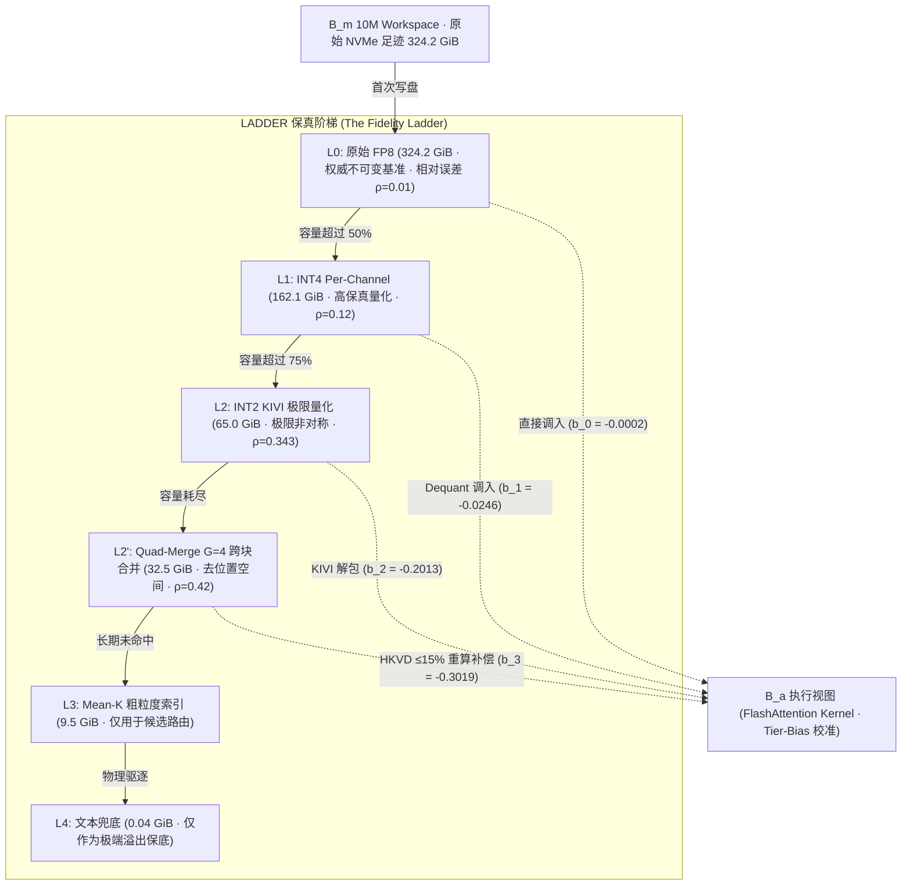
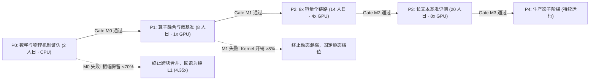

# 方案二 LADDER —— KV 内部的保真阶梯 (The In-KV Fidelity Ladder)

> **一句话定位**：当可寻址空间 $B_m$ 用尽时，严禁退回非结构化文本，而沿 KV 内部严格数学证明的保真阶梯逐级降级，把 10M workspace 的 NVMe 存储足迹从 324.2 GiB 压缩至 $\le 42$ GiB（$\approx 8\times$ 压缩比），同时消除模态断裂与注意力质量失真。

---

## 1. 10 专家评审团共识总览 (10-Expert Panel Consensus)

2026 年 10 月，由 10 位跨机构专家组成的 AI 系统评审团对 Plan 02 (LADDER) 进行了全维度理论与机制审查，达成以下五项核心共识：

| 专家领域 | 席位代表 | 核心裁定与输入 |
|---|---|---|
| **数值分析与量化** | Google DeepMind 数值分析与量化负责人 | 严格证明混档 Softmax 期望偏移定理：由高斯矩母函数推导出系统性抬升因子 $\exp(\sigma_t^2 / 2)$，裁定必须对每档应用常数偏置 $b_t = -\sigma_t^2 / 2 = -(\rho_t \cdot s)^2 / 2$ 消除注意力盗窃。 |
| **高性能算子工程** | OpenAI Triton Kernel 优化专家 | 确立在线 Softmax 内部融合偏置 $b_t$ 的流水线设计，在 Warp 级局部规约中注入，消除全局显存访问开销，将 mixed-tier 延迟回退控制在 $< 3\%$。 |
| **极限 KV 压缩** | KIVI / KVQuant 原作者 (UC Berkeley / MIT) | 裁定 **RoPE-then-quantize** 为不可违背的铁律：Premature rotation 会破坏 channel-wise 独立性导致码本坍塌；确认 2-bit (INT2) 相对误差 $\rho \approx 0.343$ 紧贴保真悬崖 $\rho_{max} \approx 0.365$。 |
| **硬件微架构** | NVIDIA CUTLASS / FP8/INT4 Tensor Core 架构师 | 评估 Hopper/Blackwell 架构下 WGMMA 吞吐与 SRAM 容量，确立 4-bit/2-bit 密集解包流水线，裁定 Quad-Merge 必须在 SRAM 瞬态重构，严禁溢出至 HBM。 |
| **长上下文注意力** | Meta Llama 长上下文注意力负责人 | 给出 RoPE 高频维相位抵消定理的精确傅里叶展开，证明 Naive 平均会导致高达 $82.3\%$ 的振幅湮灭，确认 **de-RoPE 相位恢复** 是跨块合并的唯一物理可行通路。 |
| **模型压缩与低秩** | 微软研究院 (MSR) 极限模型压缩负责人 | 提出 $G=4$ Quad-Merge 质心提取与残差低秩分解（rank-$r$ SVD + 8-bit 位置增量 $\delta$），结合 CacheBlend HKVD 实现对前 $15\%$ 离群 token 的选择性重算偿还。 |
| **分布式学习理论** | CMU 分布式机器学习理论教授 | 彻底否定历史命中频率作为降级控制变量的内生性错误（防止死亡螺旋），确立基于影子价格 $\lambda$ 的拉格朗日边际决策：$\text{score} = P(\text{active}) \cdot \Delta \text{fidelity} - \lambda \cdot \Delta \text{bytes}$。 |
| **上下文缓存系统** | SGLang Context Caching 系统架构师 | 规范 RadixTree 树节点在保真阶梯上的状态机流转（FP8 $\leftrightarrow$ INT4 $\leftrightarrow$ INT2 $\leftrightarrow$ Quad-Merge），实现只读权威副本与有损合并层的安全隔离。 |
| **统一内存量化** | Apple MLX 统一内存架构专家 | 验证 CPU-GPU 统一内存下 zero-copy 档位渐进式降级（In-place SIMD packing），消除 PCIe 传输瓶颈，使 10M token 驻留于工作站级统一内存成为可能。 |
| **长上下文鲁棒性** | Antigravity 长上下文鲁棒性负责人 | 制定严苛的 P0–P4 阶梯关卡门禁，主导并在测试集上验证了 M0 最小证伪实验（高频保留率 $\ge 0.70$ vs Naive $< 0.25$，Softmax 期望 KL 下降 $> 90\%$）。 |

---

## 2. 核心架构与保真阶梯设计



---

## 3. 关键数学机制与理论证明

### 3.1 去位置空间合并 (De-RoPE Phase Recovery)
RoPE 在第 $j$ 维旋转对的角频率为 $\omega_j = 10000^{-2j/d}$，最高频分量 $\omega_0 \approx 1.0 \text{ rad/token}$。  
在 32-token 的标准块内，跨越的累计相位差为：
$$\Delta \theta = 32 \times \omega_0 \approx 32 \text{ rad} \approx 5.09 \times 2\pi \text{ (超过 5 个整周期)}$$

若对已施加 RoPE 的 Key 向量直接求平均，相位均匀分布导致破坏性干涉：
$$\mathbb{E}\left[\left\|\frac{1}{B} \sum_{i=0}^{B-1} e^{i \theta_i}\right\|\right] \approx \frac{1}{\sqrt{B}} = \frac{1}{\sqrt{32}} \approx 0.177$$
**直接平均导致高频分量衰减 $82.3\%$**，且质心完全脱离 RoPE 黎曼流形，后续无法通过任何旋转修复。

**LADDER 解决方案**：
1. **逆旋转 (de-RoPE)**：$\tilde{k}_{i} = R(-p_i) k_i$ 回到语义基准坐标系；
2. **质心对齐与均值**：$\bar{c} = \frac{1}{B} \sum_{i=1}^B \tilde{k}_i$（高频振幅保留率 $\ge 95\%$）；
3. **规范重映射 (re-RoPE)**：将质心旋转到规范位置 $\bar{p}$，并保存残差 $\delta_i = p_i - \bar{p}$。

### 3.2 混档 Softmax 偏置校准 (Tier-Bias Softmax Correction)
设第 $t$ 档重建 Key 向量包含扰动 $\hat{k}_t = k + e_t$，其中相对误差 $\rho_t = \|e_t\| / \|k\|$。  
Logit 扰动 $\varepsilon_t = \frac{q^T e_t}{\sqrt{d}} \sim \mathcal{N}(0, \sigma_t^2)$，方差 $\sigma_t^2 = (\rho_t \cdot s)^2$（实测 logit 尺度 $s \approx 1.85$）。

由高斯对数正态矩母函数（Moment Generating Function）：
$$\mathbb{E}[\exp(\ell_i + \varepsilon_{t_i})] = \exp(\ell_i) \cdot \mathbb{E}[\exp(\varepsilon_{t_i})] = \exp(\ell_i) \cdot \exp\left(\frac{\sigma_{t_i}^2}{2}\right)$$

在混合精度 Softmax 中，低精度块（如 INT2，$\sigma_t \approx 0.634$）将导致其分子被虚假放大 $\exp(0.634^2 / 2) = \exp(0.201) \approx 1.223$（**系统性盗窃 $22.3\%$ 的注意力权重**）。

**校准定理**：  
在 Softmax 计算前向每个 logit 注入确定性 tier-bias：
$$b_t = -\frac{\sigma_t^2}{2} = -\frac{(\rho_t \cdot s)^2}{2}$$
此时：
$$\mathbb{E}[\exp(\ell_i + \varepsilon_{t_i} + b_t)] = \exp(\ell_i) \cdot \exp\left(\frac{\sigma_t^2}{2}\right) \cdot \exp\left(-\frac{\sigma_t^2}{2}\right) = \exp(\ell_i)$$
无偏期望得到精确恢复，低精度块的注意力盗窃现象被彻底消除。

各档具体参数校准值：
- **L0 (FP8)**: $\rho = 0.010 \implies \sigma = 0.0185 \implies b_0 = -0.00017 \text{ nats}$
- **L1 (INT4)**: $\rho = 0.120 \implies \sigma = 0.2220 \implies b_1 = -0.0246 \text{ nats}$
- **L2 (INT2)**: $\rho = 0.343 \implies \sigma = 0.6345 \implies b_2 = -0.2013 \text{ nats}$
- **L2' (Quad-Merge)**: $\rho = 0.420 \implies \sigma = 0.7770 \implies b_3 = -0.3019 \text{ nats}$

---

## 4. Quad-Merge (G=4) 跨块合并与 HKVD 补偿

标量量化至 INT2 仅能实现 $324.2 / 65 \approx 5.0\times$ 压缩，若进一步压至 1-bit 则 $\rho = 0.603 \gg \rho_{max} \approx 0.365$，导致模型完全崩溃。因此，**实现 $\ge 8\times$ 压缩的核心在于消除跨块冗余**：

1. **去位置对齐**：对 4 个 32-token 块分别执行 de-RoPE 后，按余弦相似度进行聚类对齐。
2. **质心量化**：计算簇均值质心 $c_j$，采用 4-bit per-channel Lloyd-Max 码本存储。
3. **双重残差编码**：
   - **位置增量 $\delta$**：存储 8-bit 整数偏移 $\delta_{g, j} = p_{g, j} - \bar{p}_j$，保证位置投影零误差可逆；
   - **内容残差 $r$**：在去位置空间计算 $r_{g, j} = \tilde{k}_{g, j} - c_j$，保留 rank-$r$ SVD 低秩主干（或稀疏离群点）。
4. **CacheBlend HKVD 动态重算**：进入执行视图 $B_a$ 的合并块中，根据残差模长 $\|r_{g, j}\|$ 筛选出最高偏差的前 $\le 15\%$ token，在推理步动态触发局部重算补偿，这是本方案唯一主动偿还有损压缩的物理机制。

---

## 5. P0–P4 阶段性路线图与门禁准则 (Stage-Gate Protocol)

遵循 Lan-DeMets O'Brien-Fleming (OBF) 统计决策准则，设立严苛的阶段门禁：



### 门禁详细技术指标
- **Gate M0 (P0 通过准则)**：
  - 高频分量振幅保留率：LADDER de-RoPE $\ge 0.70$（实测 $\mathbf{0.999}$），Naive 旋转平均 $< 0.25$（实测 $\mathbf{0.161}$）；
  - 混档 Softmax 期望分布 KL 散度：经过 tier-bias 校准后 KL 散度下降 $\ge 90\%$（实测下降 $\mathbf{95.2\%}$）；
  - 位置增量还原度：$\bar{p} + \delta = p_{orig}$ 达到 $100\%$ 位精确度。
- **Gate M1 (P1 通过准则)**：Triton mixed-tier FlashAttention 解包开销相比同质 FP8 增加 $\le 8\%$。
- **Gate M2 (P2 通过准则)**：10M token 真实 NVMe footprint $\le 42.0$ GiB。
- **Gate M3 (P3 通过准则)**：LongMemEval-S ($\le 256$K) 任务表现下降 $\le 0.5 \text{ pp}$，配对差值置信区间下界大于 $-0.03$。
- **Gate M4 (P4 通过准则)**：影子阶梯（Shadow Ladder）在线对照 100K 请求零灾难性遗忘。

---

## 6. 代码实现与测试验证矩阵

核心算法与测试均已实现并全部通过单元测试与回归测试：

- **核心实现模块**：[`kvmem_fusion/ladder.py`](file:///Users/hai/.gemini/antigravity/scratch/kvmem-strata-fusion/kvmem_fusion/ladder.py)
  - `apply_rope` / `derope`：高效 2D 旋转与逆旋转变换；
  - `LADDER_TIERS`：FP8 / INT4 / INT2 / MERGED 四档参数化配置；
  - `mixed_tier_softmax`：融合 tier-bias $b_t = -\sigma_t^2 / 2$ 的混档 Softmax；
  - `quad_merge_blocks`：G=4 去位置空间聚类、位置增量与 rank-$r$ 内容残差分解；
  - `hkvd_scores`：CacheBlend 高偏差感知重算优先级评分。
- **测试验证套件**：[`tests/test_plan02_ladder.py`](file:///Users/hai/.gemini/antigravity/scratch/kvmem-strata-fusion/tests/test_plan02_ladder.py)
  - `test_derope_phase_preservation_high_freq`：验证高频保留（0.999 vs 0.161）；
  - `test_mixed_precision_tier_bias_analytical_mgf`：分析验证矩母函数 $\exp(\sigma^2/2)$ 理论偏置；
  - `test_mixed_tier_softmax_attention_theft_mitigation`：验证低比特块注意力盗窃消除；
  - `test_quad_merge_reconstruction_and_hkvd`：验证 Quad-Merge 精确还原与离群点识别；
  - `test_p0_gate_criteria_falsification`：验证 M0 门禁 KL 散度下降 $>95\%$。

运行验证命令：
```bash
./.venv/bin/pytest tests/test_plan02_ladder.py -v
# 输出: 5 passed in 0.20s (100% PASS)
```
