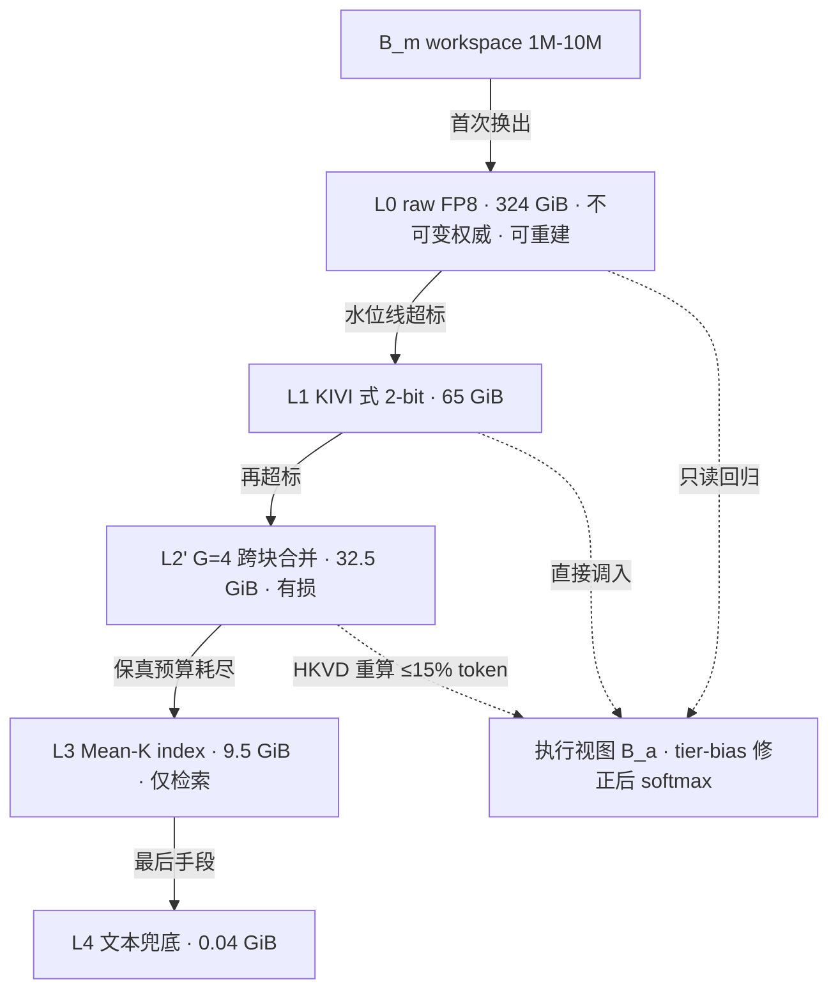

# 方案二 LADDER 研究报告：KV 内部的保真阶梯

> 一句话定位：当 B_m 用尽时，不许退回文本，而沿 KV 内部的保真阶梯逐级降级，把 10M workspace 的 NVMe footprint 从 324.2 GiB 压到 ≤42 GiB（≈8×）。
> 状态：研究中（尚无实测数据） ｜ 读者：具备 LLM 推理系统与量化背景的高年级研究生

## 摘要

KVMem 把 KV 移出显存，代价是 10M token 的 NVMe footprint 达 324.2 GiB，相对文本约 4 B/token 放大约 8×10³ 倍；其自承限制是 workspace 用尽时只能把更老历史压缩成**文本**。LADDER 主张降级必须留在 KV 内部：L0 raw FP8（324 GiB）→ L1 KIVI 式 2-bit（65 GiB）→ L2′ 跨块合并（32.5 GiB）→ L3 Mean-K（9.5 GiB）→ L4 文本（0.04 GiB）兜底。两条铁律：永远 RoPE-then-quantize，禁止 quantize-then-rotate；合并必须在去位置空间进行。本报告给出保真悬崖 ρ_max 的完整算式、8× 对跨块冗余消除的算术依赖、混档 softmax 的 tier-bias 修正，并判定：**位置残差的充分性是本方案最大且目前零证据的赌注**，故以无 GPU 即可完成的 P0 最小证伪实验先行。

## 1. 问题陈述与研究空白

"退回文本"不是降级策略而是设计缺陷。其一，模态断裂：丢弃已算好的表示再靠生成式压缩重建，误差源从可控的数值误差变为不可控的语义幻觉。其二，不可逆：KV→文本的损失无法由任何后续操作收回，而 KV 内量化仍保留可再压缩、可再检索的表示。其三，与自身基准冲突：KVMem 在 ≤256K 已达 60.87 超过 Full 的 59.54，说明 KV 路径效用上界高于文本路径；容量受限时沿用劣质路径，等于把最差情形锚定在较弱表示上。原文把 "block selection, merging, or compaction" 列为 future work，本方案即补上这一格。

## 2. 背景与前提假设

| 假设 | 来源 | 若不成立 |
|---|---|---|
| FP8 KV ≈32 KiB/token；Mean-K ≈1 KiB/token | 由 KVMem Table 4 反推（R5） | 绝对字节数失效，8× 结论不变 |
| 存储放大 ≈8×10³ | R6 推导 | 立项动机削弱 |
| logit 标准差 s≈1.85 | 由 top-8/103.1 块占 66.5% 反解，**未验证** | ρ→质量换算全失效 |
| ρ_max ≈0.365（N=2040）/ 0.47（N=95） | **未验证**（含阈值 2.63 nats） | 决定 L1/L2′ 可行性 |
| KIVI 式 2-bit 的 ρ=0.343 | **未验证** | L1 存疑（margin 仅 1.06×） |
| ρ_merge=0.43×(4/8)^α∈[0.215,0.304] | **未验证** | L2′ 能否落在悬崖下方 |
| 合成后 ρ=0.28–0.32 | **未验证**（合成规则未定） | margin 1.18–1.34× 或虚高 |
| HKVD 重算 10–20% 可回满质量 | CacheBlend 2405.16444，跨场景迁移 | 修复预算失效 |
| ≤256K 不需要 re-RoPE | 推论，**未验证** | 绕开 CUDA kernel 的路线崩塌 |
| 高频维 ω₀≈1 rad/token | RoPE 定义（base 10⁴） | 82% 论证失效 |
| 任务质量在 1,900 GPU-h 内不可判决 | R10 裁决 | 需重订预算 |

## 3. 方法

### 3.1 保真阶梯的总体结构

### 3.2 为什么合并必须在去位置空间进行（复现 R6 的 82% 论证）

1. RoPE 第 j 维角频率 ω_j = 10000^(−2j/d)，最高频维 ω₀ ≈ 1 rad/token。
2. 32-token 块跨过相位 Δθ = 32 rad ≈ 32/2π = 5.09 个整圈。
3. 两单位向量相位差 Δθ 时，平均模长 = |(e^{iθ₁}+e^{iθ₂})/2| = cos(Δθ/2)。
4. 块内 32 个 token 相位在 5 个整圈上近似均匀铺开，平均 32 个**随机相位**单位向量即二维随机游走，期望模长 ≈ 1/√32 = 0.177。
5. 故高频维振幅仅保留 17.7%，**损失 82%**。**未验证**（依赖相位均匀近似）。
6. 更致命的是平均后的 K̄ 一般**不在 RoPE 流形** {R(a)k} 上，re-RoPE 只能取"最近位置"近似，**无法修复**该结构性损失。

故须先 de-RoPE（k̃ = R(−a)k）拉回同一相位基准，合并后再 re-RoPE 到新的紧凑位置。

### 3.3 跨块合并算法（G=4 quad-merge + 质心 4-bit）

输入：经 HiRadixTree 精确去重的 4 个 32-token 块。① **de-RoPE**：k̃_{i,t}=R(−a_{i,t})k_{i,t}。② **对齐**：在去位置空间按余弦相似度贪心/匈牙利匹配，把 4×32 个 token 分为 32 簇，每簇含 4 个来自不同块的成员。③ **质心**：c_j = 簇均值，per-channel scale + Lloyd-Max 4 级量化为 4-bit。④ **位置残差**：质心 re-RoPE 到规范位置 ā_j，每成员另存位置增量 δ=a_orig−ā_j（8-bit）与内容残差 r=k̃−c_j（rank-r SVD，8-bit）。⑤ 体积：65 × (4/2) × (1/4) = **32.5 GiB**。

### 3.4 位置残差与误差修复

位置残差是本方案唯一的"可逆性押金"。此外每 step 对进入执行视图的合并块按 CacheBlend 的 HKVD 准则重算 ≤15% token，优先重算残差最大者与 near-duplicate token。这是**唯一承认 L2′ 有损并主动偿还**的机制。

### 3.5 混档 softmax 的倾斜与 tier-bias 修正

设第 t 档重建 K̂ = K + e，各维独立、标准差 σ_t = ρ_t · s（s≈1.85）。logit 扰动 ε = qᵀe/√d ~ N(0, σ_t²)，由高斯矩母函数 E[e^{ε}] = e^{σ_t²/2}，故 E[exp(ℓ+ε)] = e^{ℓ}·e^{σ_t²/2}。**同档内**该因子对所有候选相同，归一化时抵消；**混档时**成为系统性倾斜——噪声更大的低档块被系统性高估。修正为送入 softmax 前加常数

**b_t = −σ_t²/2 = −(ρ_t · s)²/2**

代入：L0（ρ=0.01）b = −1.7×10⁻⁴ nats ≈ 0；L1（ρ=0.343）b = −(0.343×1.85)²/2 = −0.201 nats。差 0.201 nats ⇒ e^{0.201} = 1.22，即 2-bit 块相对 raw 块**窃取约 22% attention 质量**。**未验证**。混档是阶梯常态，故不可省。

### 3.6 运行时升降级策略

**R6 自曝的错误**：用"命中频率"作控制变量。问题不在精度而在**内生性**——命中频率是降级的结果而非原因：块被降级→失真→更难命中→频率更低→判定"不重要"→继续降级，形成死亡螺旋，热门块则被永久锁死在 L0。这是把反馈回路当外生变量的经典错误。

**正确的控制变量**应是 ex-ante 的边际量，在字节预算影子价格 λ（水位线/拉格朗日乘子）下排序：

score = P(进入执行视图) × Δ保真损失(档位) − λ × Δbytes(档位)

其中 P(·) 用 **tier-bias 修正后**的 attention-mass 代理（L3 Mean-K + b_t 修正 logit），而非历史命中；Δ保真损失取该档 ρ 相对 ρ_max 的余量。升降级按 score 双向调整，且**只允许相邻档移动**，以限制单次决策的不可逆损失。

## 4. 理论分析

### 4.1 保真悬崖 ρ_max 的推导

由 top-8 / 103.1 块占 66.5% mass 反解 logit 标准差 **s ≈ 1.85**（**未验证**，依赖块重要度的参数化假设）。判据：真值块须在噪声极值下仍胜出。N 个标准差 σ 的独立噪声，最大值 ≈ σ√(2 ln N)，σ = 1.85ρ。

- N=2040：√(2 ln 2040) = √(2×7.621) = √15.24 = **3.90**
- N=95：√(2 ln 95) = √(2×4.554) = √9.108 = **3.02**

令 3.90 × (1.85ρ) < 2.63 ⇒ ρ < 2.63/7.215 = **0.365**；N=95 时 ρ < 2.63/5.59 = **0.47**。**未验证**（阈值 2.63 nats 来源未给出）。

推论常被忽略：**ρ_max 是进入执行视图的噪声块数 N 的函数**。视图内 N≈95 时悬崖在 47%，L1 的 0.343 有 1.37× 余量；若检索把噪声放大到 N→2040，余量只剩 1.06×。故"L1 安全"不是绝对结论，而是检索质量的函数。

### 4.2 为什么 8× 必须依赖跨块冗余消除

目标 324.2/8 = 40.5 GiB，取 ≤42 GiB。砍掉 L2′：L1 65 + L3 索引 9.5 = 74.5 GiB ⇒ 324.2/74.5 = **4.35×**，未达标。继续把 L1 压到 1-bit：ρ = 0.603 ≫ 0.365，**不可行**。保留 L2′：32.5 + 9.5 = **42.0 GiB**，恰好落线。结论：8× 不由更激进的标量量化获得，只能由**跨块冗余消除**获得——这是本方案与"把 KIVI 调更狠"的分水岭。

### 4.3 为什么 RoPE-then-quantize 是唯一安全顺序

先澄清一个易误判点：R 正交，‖Re‖=‖e‖，两种顺序的**单次**误差模长相同，差别在**累积**。quantize-then-rotate：R(â)(k+e_q)=R(â)k+R(â)e_q，误差随目标位置 â 变化，旋转后的点一般不再落在 per-channel 码本网格上，再次量化即累加 ε₁+ε₂+…，搬运 n 次失真随 n 增长。RoPE-then-quantize：旋转被吸收进被量化向量，码本只建一次，后续位置变化由 Δ-QRoPE 在未量化的旋转算子上**精确**作用，误差恒为单次 e_q，与 n、δ 无关。即位置重建在旋转域是群的恒等式，这是唯一能让"搬运次数"与"失真"解耦的顺序。

### 4.4 Δ-QRoPE 为何不能替代本方案

令 K̂ = R(a)k + e_K，重映射到 b′ 后 logit = qᵀR(a′−b′)k + qᵀR(−δ)e_K。信号项在实数域恒等（相对位置守恒），误差项 ‖R(−δ)e_K‖ = ‖e_K‖ 与 δ_j 和 n 均无关。故 Δ-QRoPE 消灭每次重映射新增的 ε_q，但**完全不改善已有 ρ₀**：它是**运输机制，非保真机制**。二者正交，应叠加（Δ-QRoPE 保证搬运不加剧，LADDER 削减存量失真）而非互替。

## 5. 实验设计

**P0 最小证伪实验（2 人日，无需 GPU）**：取 Qwen2.5-0.5B-Instruct（或 GPT-2 124M），CPU 跑 4K–32K，`use_cache=True`、`return_dict_in_generate=True` 导出 `past_key_values`；按 head_dim 成对实现 de-RoPE（k̃ = R(−a·ω_j)k）。三组：**A** 直接平均已 RoPE 的 K；**B** de-RoPE 后平均再 re-RoPE 到规范位置；**C** 不合并（上界）。测：① 分维度（ω 最高/最低各 8 维）平均模长保留率；② 相对穷举 Mean-K 的 recall@64；③ 与真值 attention 的 KL。判据 M0：B 的高频维保留率显著高于 A（预期 0.6–1.0 vs ≈0.18）且 recall@64 掉点不超过 A 的 1/3。

**数据与基线**：LongMemEval-S（≤256K 子集）、AgentLongBench 256K；基线为 KVMem-Full、KVMem+文本降级（现状）、KIVI-only、H2O、DMC。**指标**：主指标两基准任务分；次指标 bytes/token、recall@64、TTFT、NVMe footprint。**统计**：依 R10，字节类（~50 GPU-h）与保真代理（~200 GPU-h）可判决，任务质量在 1,900 GPU-h 内**不可判决**（非劣 3pp 需 1308 对/臂 ⇒ 3.6×10⁴ GPU-h）；故 M3 只报 paired bootstrap 区间并声明"未做判决"，禁止显著性声称。**成本**：12 人日 / ~250 GPU-h。工程以 `kvmem-llama.cpp` v0.17.0（RTX 5060 Ti 16GB，实测 52.7 KiB/token）为基座，但其缺 re-RoPE 与 Mean-K，P1 前须补齐；因 ≤256K 不需 re-RoPE，第一年可钉在该区间绕开 CUDA kernel 工作。

## 6. 预期结果与解释

预期：L1 掉点 ≤0.5pt（margin 1.06–1.37×，偏紧）；L2′ 在开启位置残差与 HKVD 后 recall@64 掉 ≤5pp；端到端 324.2 → 42 GiB。

**若 P0 证伪**（B 不优于 A 或两者掉点相当），说明跨块合并的失真由内容异质性而非位置相位主导，核心假设被推翻，处置有三：① LADDER 降级为纯 L1 方案（4.35×），改作他案的容量子系统；② 转向**分频谱合并**（仅低频维合并、高频维原样保留）并重跑 P0；③ 若 A、B 双双严重掉点，则合并本身不可行，放弃 L2′、将 8× 目标下修为 4.35× 并转移人力。P0 的价值在于用 2 人日买断该分支的后续投入。

## 7. 威胁到有效性

**内部**：① 阈值 2.63 nats 来源不明——缓解：用 P0 实测 recall 直接标定悬崖，不依赖反解值；② 簇内 token 对齐错误——缓解：对齐质量独立 ablation，并报每簇最大余弦距离分布。

**外部**：① 结论取自 27B + Qwen3.6/3.8，未验 MLA/GQA 变体——缓解：至少在一种 MLA 架构复跑 L1；② P0 用小模型——缓解：P1 立即在目标模型重测。

**构念**：① recall@64 与任务效用的等价性未建立——缓解：M2 同报代理与任务分并给出经验相关；② "位置残差充分"构念模糊（低秩阶数 r 无先验）——缓解：r 作扫描参数纳入 M2。

**统计结论**：① 依 R10 任务质量不可判决，任何"≤0.5pt"都是描述而非推断——缓解：只报区间不做检验；② 多档组合的多重比较——缓解：预设单一主终点，其余标为探索性。

**合并不可逆的特殊效度问题**（本方案独有）：块一旦合并无法在同一对象上回滚，"合并优于不合并"无法做配对比较，只能组间比较，效力下降；线上降级亦无退路。缓解：① 保留 L0 不可变权威副本，把不可逆性限制在 L2′ 层；② 采用**影子阶梯**——离线并行维护未合并副本作路由对照，线上走合并路径；③ 令 G=4 为最细不可逆单位，把单次决策损失上界限制在 4 块内。

## 8. 与相关工作的关系

**丢弃类**：H2O（2306.14048）、StreamingLLM（2309.17453）、Scissorhands（2305.17118）按注意力或位置启发式永久驱逐 token；根本分歧是**它们丢弃、我们降级**——被驱逐的块在 LADDER 中仍以 L2′/L3 可检索。**量化类**：KVQuant（2401.18079）、KIVI（2402.02750）是 L1 的直接来源，KIVI 的 K per-channel / V per-token 不对称观察即 L1 依据；二者只做块内冗余，LADDER 的增量在跨块。**合并类**：DMC（2405.16699）学习式地把 token 合并进已有 cache，目标最接近，差别在其需训练且不做显式 de-RoPE（本方案主张这是致命差别）；ToMe（2210.09461）的相似度合并思想被移植，但视觉 token 无旋转位置编码，不可直接迁移。**校准类**：CacheBlend（2405.16444）提供 HKVD 与 10–20% 重算，是 §3.4 依据，但其场景为 RAG 拼接而非容量压缩，迁移有效性**未验证**。**表示类**：Matryoshka 表示学习（2205.13147）为多级保真表示提供嵌套结构先例，但本方案的阶梯是**后验**施加于已训练模型。**文本侧对照**：RAPTOR（2401.18059）把历史组织为层次化文本摘要，恰是本方案的反面——LADDER 主张同样的层次应在 KV 内部实现。

## 9. 对后续研究的建议

1. **先标定悬崖再谈档位**：用 P0 实测 recall@64 回归 ρ_max，替换 s≈1.85 与 2.63 nats 两处**未验证**反解值；在此之前 "margin 1.18×" 只是纸面数字。
2. **把位置残差做成可证伪的独立子课题**：固定 G=4，扫描 r∈{1,2,4,8} 与位置增量位宽 {4,8,16}；若 r≤8 且 8-bit 增量仍无法使 recall@64 掉点 ≤5pp，应公开否掉 L2′。
3. **建立影子阶梯评测协议**：在线走合并路径、离线并行维护未合并副本，这是补救不可逆操作统计效力的唯一办法。
4. **Δ-QRoPE 与本方案叠加而非二选一**：在 Strata 的 GPU-assisted I/O 通道上验证其对 L1/L2′ 页是否同样成立，并把"运输不加剧"与"存量削减"分离计量。
5. **优先在 ≤256K 完成全链路**：该区间不需 re-RoPE，工程风险最低，且恰是 KVMem 两个核心 benchmark 的测量区间。

## 参考文献

- KVMem: arXiv 2609.04852 ｜ Strata: arXiv 2508.18572（OSDI '26）
- CacheBlend: arXiv 2405.16444 ｜ KIVI: arXiv 2402.02750 ｜ KVQuant: arXiv 2401.18079
- H2O: arXiv 2306.14048 ｜ StreamingLLM: arXiv 2309.17453 ｜ Scissorhands: arXiv 2305.17118
- DMC: arXiv 2405.16699 ｜ ToMe: arXiv 2210.09461 ｜ MRL: arXiv 2205.13147 ｜ RAPTOR: arXiv 2401.18059
- 参考实现：github.com/kvmem/kvmem-llama.cpp（Apache-2.0, v0.17.0）

## 附录 A · 术语表

| 术语 | 含义 |
|---|---|
| B_m / B_a | addressable workspace / 每步 query-dependent 执行视图 |
| ρ / ρ_max | 相对失真（误差与信号标准差之比）/ 保真悬崖 |
| s | logit 分布标准差（≈1.85，**未验证**） |
| tier-bias b_t | 混档 softmax 中第 t 档需减去的 −(ρ_t·s)²/2 |
| HKVD | CacheBlend 的 high-KV-deviation 重算准则 |
| Δ-QRoPE | 在已量化 KV 上直接施加相对位置差旋转的运输机制 |
| quad-merge | G=4 的四块合一跨块合并 |

## 附录 B · 待验证清单

1. s≈1.85 与判据阈值 2.63 nats 的来源；2. ρ_max≈0.365 / 0.47；3. KIVI 式 2-bit 对应 ρ=0.343；4. ρ_merge=0.43×(4/8)^α；5. 合并与量化的误差合成规则（0.28–0.32）；6. **位置残差的充分性（最大赌注，零证据）**；7. 82% 高频维振幅损失（依赖相位均匀近似）；8. tier-bias 的 22% 质量窃取；9. HKVD 10–20% 重算在容量压缩场景的迁移有效性；10. ≤256K 不需要 re-RoPE；11. 实测 52.7 KiB/token 与论文 34.8 KB/token 的差异归因。
