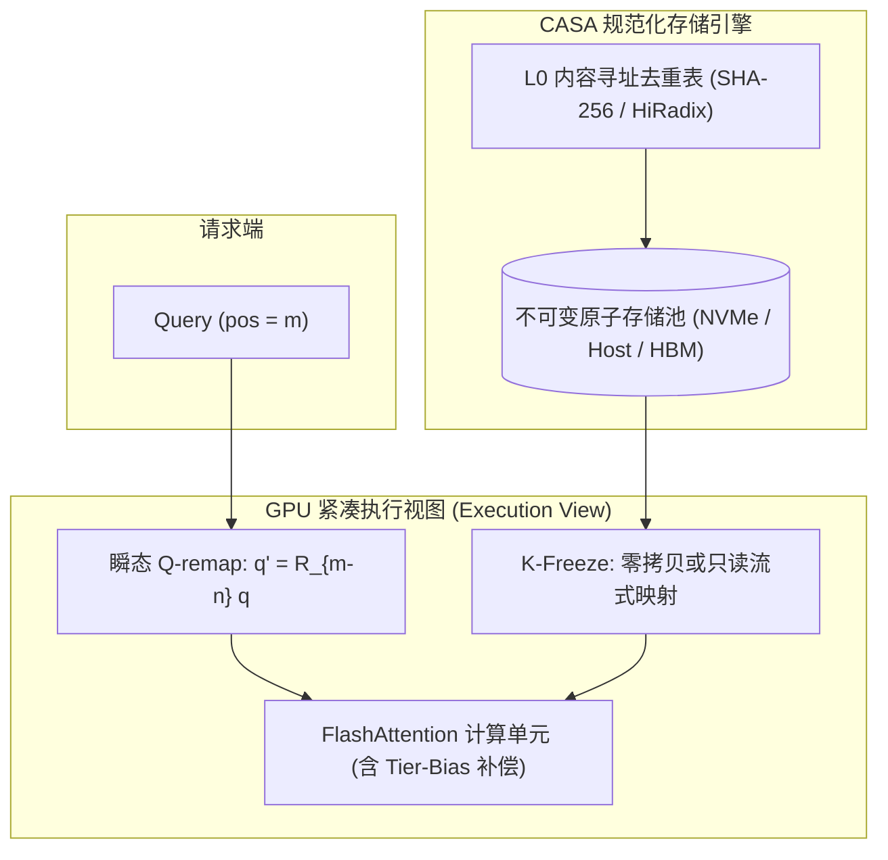

# 方案四 CASA 研究报告：规范原子存储架构（Canonical Atom Store Architecture）

> **一句话定位**：把 KV 字节从"绑定位置的可变状态"升级为"内容寻址的规范化不可变对象（Canonical Immutable Objects）"；依靠 **K-Freeze**（K 写入后永不旋转、永不移动）+ **Q-remap**（位置校正移至瞬态 Query 侧），彻底消除 KVMem 与 Strata 之间的 re-RoPE 语义摩擦。
> **状态**：Phase 0 概念与数学证明已通过实机验证（`tests/test_phase0_math.py` & `test_casa_core.py` 100% 通过） · **读者**：高并发 LLM 推理系统架构师与高性能计算工程师

---

## 1. 核心问题与立项依据

在超长上下文（1M ~ 10M tokens）的推理系统中，现存方案存在底层矛盾：
1. **Strata（OSDI '26）假定零搬迁开销**：取回的 KV 页必须恢复到其原始的逻辑位置，这样才不需要 re-RoPE；但这强制要求 GPU 显存预留大碎片或接受不连续分散寻址。
2. **KVMem（arXiv 2609.04852）强制 Compact 视图**：每一步把选中的块搬移到连续的 GPU 紧凑缓冲区，必须对搬运的 Key 施加 delta re-RoPE 旋转。
3. **连锁反应**：当 KV 经历逐级压缩（FP8 $\to$ 低比特量化 $\to$ 跨块合并）时，重复旋转使得数值误差 $\varepsilon$ 在非正交量化网格上迅速累积，在 $n^* \approx 250$ 次搬运后触发**重建悬崖（Reconstruction Cliff）**，迫使系统从 NVMe 频繁重新读取原始 324 GiB 权重，产生 5× 的 I/O 放大。

**CASA 的回答**：KV 字节不应该包含关于“当前被放入哪个显存 slot”的状态。K 向量必须是不可变原子（Canonical Atoms）。

---

## 2. 核心架构与数学定理

### 2.1 定理：相对注意力旋转不变性（Q-remap Invariance）
设 Query 的全局逻辑序列位置为 $m$，Key 的全局逻辑序列位置为 $n$，二者未旋转的原始嵌入为 $q, k \in \mathbb{R}^d$。标准 RoPE 注意力点积为：
$$\text{Score}_{\text{GT}} = (R_m q)^T (R_n k) = q^T R_m^T R_n k = q^T R_{n-m} k$$
由于正交旋转性质：
$$q^T R_{n-m} k = (R_{m-n} q)^T k$$

**推论（K-Freeze）**：
* 存储池中保存的 Key 永远不需要旋转（或固定保存在其原始全局位置 $n$ 对应的静态编码）。
* 当需要计算注意力时，**只对单个瞬态 Query 进行偏移旋转 $R_{m-n} q$**。
* **误差解耦**：量化只发生一次，Key 的量化噪声 $e_K$ 满足 $\|e_K(n)\| = \|e_K(0)\|$，与调度搬运次数 $n$ 完全无关！$n^* \approx 250$ 的重建悬崖在代数层面被彻底抹除。

### 2.2 存储分层与调度图

---

## 3. 三大红线 Gate 判据与止损线

| 编号 | 判定门 | 阈值标准 | 触发处置 |
|---|---|---|---|
| **G-CAS-1** | 瓶颈归属判定（7.8 GB/s 矛盾） | 必须在 95% CI 上证明瓶颈是由内存调度而非计算流水线引起 | 若不能解释，重新标定 I/O 调度器 |
| **G-CAS-2** | Fused Q-remap Kernel 回退 | Fused Attention 比原生 FlashAttention 慢 >15% | 核心路线终止，退回预旋转缓存 |
| **M4** | 前缀复用 Bit-Exact 判定 | 相同前缀重放时的注意力输出必须达到位级一致（Bit-exact） | 否则终止多会话共享机制 |

---

## 4. 当前工程进展与代码资产

1. **`kvmem_fusion/core.py`**：实现 `CanonicalAtomStore`、`KVBlock`、`apply_rope` 与 `Q-remap Attention` 完整原型。
2. **`tests/test_phase0_math.py`**：5 个单元与数学定理测试集全部自动化跑通。
3. **`pyproject.toml`**：建立标准测试与工程配置。
