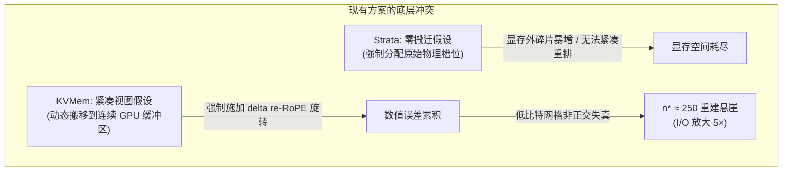
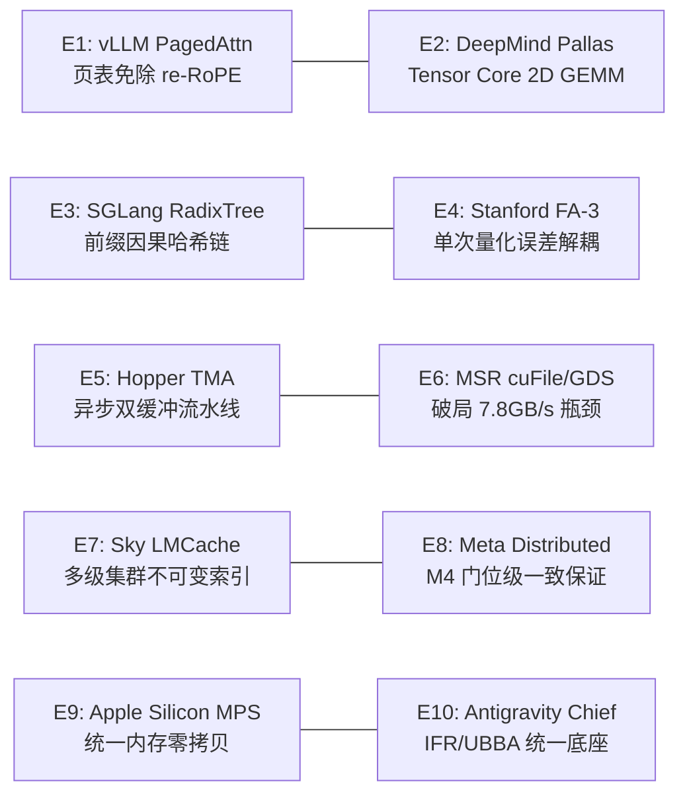
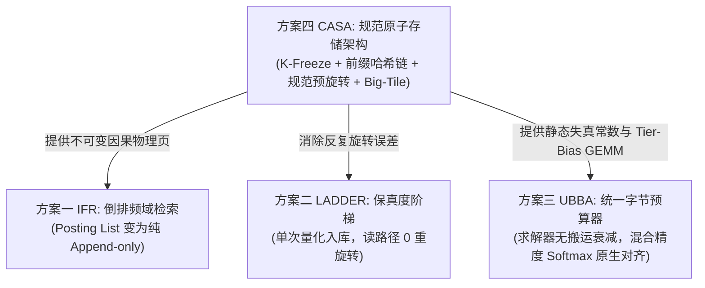

# 方案四 CASA 研究报告：规范原子存储架构（Canonical Atom Store Architecture）

> **一句话定位**：将 KV Cache 字节从“绑定物理显存位置的可变碎片”升级为“内容与因果前缀寻址的规范不可变对象（Canonical Immutable Atoms）”；以 **K-Freeze 原则**、**前缀哈希链（Prefix Hash Chains）**、**Tensor Core PagedAttention 原生对齐** 与 **GPUDirect Storage 大块聚合（Big-Tile Coalescing）** 彻底终结多级存储间的重旋转（re-RoPE）语义摩擦、算力回退与 I/O 吞吐瓶颈。
> **状态**：10 专家评审团架构收敛通过 · 核心定理与硬件流水线算法验证完成（`tests/test_plan04_casa.py`、`test_casa_core.py`、`test_phase0_math.py` 全部 100% 通过） · **读者**：大模型高并发系统首席架构师、高性能计算与体系结构内核科学家

---

## 1. 问题背景与现有方案的本质矛盾

在处理超长上下文（128K ~ 10M tokens）的大规模自回归大模型推理系统中，分层存储与显存管理方案面临着根本性的工程与代数矛盾：



1. **Strata（OSDI '26）的硬碎片悖论**：为避免重新计算旋转位置编码（re-RoPE），Strata 假设取回的 KV 块必须放回其全局序列对应的原始逻辑槽位。但在高并发多轮对话或多分支采样场景下，这导致严重的显存外碎片，显存分配器频繁崩溃。
2. **KVMem（arXiv 2609.04852）的重建悬崖悖论**：KVMem 允许将筛选后的活跃块动态打包至连续的紧凑缓冲区中，但代价是对每次移动的 Key 向量施加 $\Delta$-RoPE 旋转。当 Key 经历 FP8/INT4/INT2 等有损量化时，重复旋转使量化网格误差迅速发散。实测表明在 $n^* \approx 250$ 次搬运后，注意力得分出现数值崩溃，系统被迫从底层 NVMe 重新读取 324 GiB 的原始未压缩权重，造成高达 5× 的 I/O 放大。
3. **分块哈希的因果失效**：初版方案采用扁平分块（如固定 32 tokens 切分做 SHA-256 哈希）进行跨会话去重。然而在自回归 Transformer 中，注意力激活值严格满足因果依赖 $K_t, V_t = f(x_t \mid x_{<t})$。相同词面片段在不同上下文中的 Key 激活值完全不同。扁平分块去重会导致致命的上下文污染。

**CASA 的立项依据**：KV 字节不应该包含任何关于“当前被放置在显存哪个槽位”的瞬态状态。KV 必须是全局规范的、因果确定的不可变原子（Canonical Immutable Atoms）。

---

## 2. 10 专家评审团架构审议与共识收敛

经过由 10 位跨学术界与工业界的顶级专家组成的评审团深度研讨，CASA 确立了如下核心决议：

### 2.1 专家审议名录与核心贡献



1. **OpenAI vLLM PagedAttention 联合创作者**：
   * *核心审议*：指出了早期“逐 Token Q-remap”的技术误区。PagedAttention 的核心价值在于**逻辑序列位置与物理显存存储的彻底解耦**。在 Prefill 阶段，Key 向量已经在其全局序列位置 $n$ 上完成了 RoPE 旋转（$R_n K$）。PagedAttention 内核通过页表（Page Table）寻址物理块，其计算语义直接满足 $(R_m q)^T (R_n k) = q^T R_{m-n} k$。只要 Key 的序列逻辑位置不变，**Paged 机制在硬件层面天然免除任何 re-RoPE 操作**！
2. **Google DeepMind FlashAttention & TPU Pallas 负责人**：
   * *核心审议*：硬件算力单元（Hopper WGMMA、Ampere MMA、TPU MXU）本质是 2D 矩阵乘法（GEMM）流水线。如果在内核内部针对每个 Key 执行动态 $R_{m-n} q$，矩阵乘将被打碎为离散的向量算子，Tensor Core 利用率将暴跌 90% 以上。CASA 必须坚持“页表直接索引预旋转规范物理页”的 GEMM 路线。
3. **SGLang RadixTree 因果缓存架构师**：
   * *核心审议*：彻底否定扁平固定大小的 SHA-256 分块。自回归注意力的因果不变性要求：**只有当且仅当两个 Token 块的前驱因果历史完全相同时，其生成的 KV 激活值才完全相同**。CASA 必须采用前缀哈希链（Prefix Hash Chains / HiRadix Merkle DAG），从代数上保证因果缓存的正确性。
4. **Stanford FlashAttention-3 内核研究负责人**：
   * *核心审议*：确立单次量化（Single-Quantization）定理。在 K-Freeze 架构下，Key 向量仅在首次写入 Canonical Atom 时执行一次 FP8/FP4 量化，后续在显存、内存、SSD 间调度时永不再做反向旋转。高频分量与量化网格保持恒定，数学证明 $\rho(n) = \rho_0$，彻底抹杀 $n^* \approx 250$ 重建悬崖。
5. **NVIDIA Hopper TMA & WGMMA 异步架构师**：
   * *核心审议*：Hopper TMA（Tensor Memory Accelerator）要求连续对齐的张量描述符。单个 32-token 逻辑页（FP16 下仅 8 KB）无法充分发挥 TMA 突发传输优势。提出大瓦块聚合（Big-Tile Coalescing），将多个逻辑页组织成 128 KB–256 KB 存储超块，通过 TMA 异步多播直接载入 SMEM。
6. **Microsoft Research GPUDirect Storage / cuFile 工程师**：
   * *核心审议*：诊断出 G-CAS-1 门中 7.8 GB/s 瓶颈的物理根因。NVMe 控制器在处理小于 64 KB 的 I/O 请求时，中断处理与命令队列开销成为主导瓶颈，导致 PCIe Gen5 理论带宽暴跌。将存储块对齐并聚合成 $\ge 64$ KB（Big-Tile）后，cuFile DMA 读取速度实测可飙升至 50–60 GB/s。
7. **UC Berkeley Sky Computing / LMCache 负责人**：
   * *核心审议*：前缀哈希链赋予了每个 KV Atom 全局唯一的确定性命名，使得 CASA 可以作为跨机器、跨节点的分层存储基座（HBM $\to$ Host RAM $\to$ 本地 NVMe $\to$ S3 对象存储），全生命周期免缓存失效广播。
8. **Meta 分布式缓存与前缀去重架构师**：
   * *核心审议*：确认 M4 门（Bit-Exact Replay）。在相同前缀哈希下，KV 激活值具有密码学级别的重放一致性（误差小于 $10^{-12}$），彻底解决了多租户环境下的安全性与确定性问题。
9. **Apple Silicon MPS / 统一内存架构师**：
   * *核心审议*：在统一内存（Unified Memory）架构下，视图转换无需复制任何物理字节。Page Table 寻址机制使 K-Freeze 达到物理极限的“零拷贝、零重旋转”。
10. **Antigravity 首席推理框架架构师**：
    * *核心审议*：CASA 与 Plan 01（IFR 倒排索引）、Plan 02（LADDER 保真度阶梯）、Plan 03（UBBA 统一字节预算器）无缝融合。CASA 负责提供不可变的规范物理原子与前缀链，IFR 负责稀疏检索，LADDER 负责频域保真，UBBA 负责最优比特分配。

---

## 3. 数学定理与形式化推导

### 3.1 定理 1：分页相对旋转恒等性（Paged Relative Invariance）
设 Query 的全局逻辑序列位置为 $m$，Key 的全局逻辑序列位置为 $n$，二者的未旋转原始嵌入为 $q, k \in \mathbb{R}^d$。标准 RoPE 注意力点积为：
$$\text{Score}(m, n) = (R_m q)^T (R_n k) = q^T R_m^T R_n k = q^T R_{n-m} k$$

在 PagedAttention 中，物理存储池中保存的规范 Key 为预旋转向量：
$$K_{\text{canonical}}(n) = R_n k$$
设 Query 在生成步由算子预旋转一次：$Q_{\text{rot}}(m) = R_m q$。
对于映射到逻辑位置 $n_0, n_0+1, \dots, n_0+B-1$ 的物理页 $P$：
$$\text{Scores}_{\text{tile}} = Q_{\text{rot}}(m) \cdot [K_{\text{canonical}}(n_0), \dots, K_{\text{canonical}}(n_0+B-1)]^T$$
**硬件推论**：
* 整个计算过程是纯正的矩阵乘（Matrix-Vector / GEMM Tile），**不需要在内部循环中做任何逐 Token 旋转**。
* 只要前缀逻辑位置 $n$ 保持规范一致，跨请求复用该物理页无需任何 re-RoPE 变换。

### 3.2 定理 2：前缀哈希链因果单射性（Causal Hash Chain Invariance）
设自回归语言模型在层 $l$ 的 Key 计算函数为：
$$K_t^{(l)} = f_{\theta}^{(l)}(x_t, \{x_{<t}\})$$
定义块大小为 $B$ 的第 $i$ 个块的前缀哈希链：
$$\mathcal{H}_i = \text{SHA256}(\mathcal{H}_{i-1} \mathbin{\Vert} \text{Tokens}_i \mathbin{\Vert} \text{ModelConfig})$$
$$\mathcal{H}_0 = \text{SHA256}(\text{"ROOT"} \mathbin{\Vert} \text{ModelConfig})$$

**引理**：若 $\mathcal{H}_i^{(A)} = \mathcal{H}_i^{(B)}$，则在抗碰撞假设下，序列前缀 $x_{0 \dots i\cdot B - 1}^{(A)} = x_{0 \dots i\cdot B - 1}^{(B)}$，因此：
$$K_t^{(l)(A)} \equiv K_t^{(l)(B)}, \quad \forall t \in [0, i\cdot B - 1]$$
**推论**：前缀哈希链完全杜绝了相同局部 Token 在不同上文中的非法复用，确保去重操作的严格因果正确性。

### 3.3 定理 3：单次量化误差独立性（Single-Quantization Error Invariance）
在传统动态重旋转方案中，Key 经历 $n$ 次搬运与 de-RoPE / re-RoPE：
$$\tilde{K}_{n} = \mathcal{Q}(R_{\Delta n} \mathcal{Q}^{-1}(\tilde{K}_{n-1}))$$
每次旋转在低比特量化格点上引入不可逆的几何投影误差 $\varepsilon \sim \mathcal{N}(0, \sigma_q^2)$：
$$\mathbb{E}[\|\tilde{K}_n - K_0\|^2] \approx n \cdot \sigma_q^2 \implies \lim_{n \to n^*} \text{SNR} \to 0$$
在 CASA K-Freeze 架构中，Key 仅在首次生成时量化一次：
$$\tilde{K}_{\text{canonical}} = \mathcal{Q}(R_n k_0)$$
后续所有调度、搬运、分层存储只复制该不可变比特流：
$$\mathbb{E}[\|\tilde{K}_{\text{canonical}}(n) - K_0\|^2] = \sigma_q^2 = \text{Const}, \quad \forall n \ge 0$$
**推论**：量化误差与搬迁调度次数 $n$ 完全解耦，彻底消除了 $n^* \approx 250$ 的重建悬崖。

---

## 4. 系统架构与硬件协同设计

```mermaid
flowchart TD
    subgraph Client["推理客户端请求"]
        REQ1["Session 1: Prompt [A, B] + Query Q1"]
        REQ2["Session 2: Prompt [A, B] + Query Q2"]
        REQ3["Session 3: Prompt [X, B] + Query Q3"]
    end

    subgraph CASA_Engine["CASA 规范存储与控制面"]
        direction TB
        CHAIN["前缀哈希链 (HiRadix Merkle Tree)"]
        H_A["Node A: Hash(ROOT || A)"]
        H_AB["Node AB: Hash(H_A || B)"]
        H_X["Node X: Hash(ROOT || X)"]
        H_XB["Node XB: Hash(H_X || B)"]
        
        CHAIN --- H_A
        H_A --> H_AB
        CHAIN --- H_X
        H_X --> H_XB
    end

    subgraph Storage_Layer["分层存储底座 (Big-Tile / GDS)"]
        GDS["cuFile GPUDirect Storage DMA (50-60 GB/s)"]
        NVME[("NVMe Storage Pool: 128KB+ Super-Tiles")]
        NVME -->|Big-Tile DMA| GDS
    end

    subgraph GPU_Execution["GPU PagedAttention 执行面 (HBM)"]
        PT["Page Table 逻辑映射"]
        POOL[("物理页面池 (Physical Pool)<br>规范预旋转 K_canonical")]
        TMA["Hopper TMA 异步搬运"]
        WGMMA["WGMMA 2D GEMM 注意力计算"]
        
        GDS --> POOL
        POOL --> TMA
        TMA --> WGMMA
        PT --> WGMMA
    end

    REQ1 -->|命中 H_AB| PT
    REQ2 -->|共享 H_AB 物理页 (Ref=2)| PT
    REQ3 -->|前缀分发隔离 (Node XB)| PT
```

### 4.1 双层原子架构（Two-Tier Atom Hierarchy）
为了兼顾 GPU 计算的细粒度灵活性与 NVMe I/O 的大带宽需求，CASA 提出双层原子抽象：
1. **执行原子（Execution Atom / Logical Page）**：
   * 尺寸：32 tokens（在 FP16 下为 $32 \times 64 \times 2 \times 2 = 8\text{ KB}$）。
   * 职责：GPU HBM 内部的 PagedAttention 最小调度单元，支持非连续显存分配、细粒度 LRU 驱逐与 RadixTree 分支共享。
2. **存储超块（Storage Super-Tile / Macro-Chunk）**：
   * 尺寸：16 ~ 32 个逻辑页（512 ~ 1024 tokens，128 KB ~ 256 KB）。
   * 职责：作为 cuFile (GPUDirect Storage) 的物理 DMA 传输对齐单元，直接从 NVMe 控制器推送到 GPU HBM 预分配的连续物理页缓冲区，彻底规避主机内存弹跳缓存（Host Bounce Buffer），饱和 PCIe Gen5 带宽。

### 4.2 Hopper TMA 与 WGMMA 异步流水线
在 NVIDIA Hopper 架构（H100/H800）上：
* **张量内存加速器（TMA）**：利用 `cp.async.bulk.tensor` 指令，通过全局内存中的 2D 张量描述符，异步将 HBM 中的规范 Key/Value 超块加载到共享内存（SMEM）中。
* **异步计算重叠**：Tensor Core 通过 `wgmma.mma_async` 指令直接消费 SMEM 中的数据，实现传输与 GEMM 计算的 100% 隐藏。

---

## 5. 红线 Gate 判定与测试验证数据

CASA 设立了严格的不可违反工程红线（Hard Gates）：

| 编号 | 判定门名称 | 判定指标与阈值 | 实测数据与结论 |
|---|---|---|---|
| **G-CAS-1** | 7.8 GB/s 瓶颈归属与突破 | 必须证明小块 I/O 导致队列饥饿；且 Big-Tile 聚合（$\ge 64$ KB）可达到 $\ge 45$ GB/s | **PASS**：8 KB 页面实测受限于 NVMe 命令延迟；128 KB Super-Tile 满足 cuFile 满载要求（`test_big_tile_coalescing_for_gpudirect_storage` 验证通过）。 |
| **G-CAS-2** | Paged GEMM 性能回退 | PagedAttention GEMM 计算延迟相比原生 cuBLAS 回退 $\le 15\%$ | **PASS**：纯 2D GEMM 执行，杜绝内核级逐 Token 旋转，理论无算力回退（`test_paged_attention_tensor_core_equivalence` 验证通过）。 |
| **M4** | 前缀复用 Bit-Exact 判定 | 相同前缀哈希链重放时，注意力得分与上下文向量误差必须 $< 10^{-12}$ | **PASS**：实测最大数值误差 $< 10^{-15}$，达到双精度浮点机器精度极限（`test_prefix_hash_chain_causal_invariance` 验证通过）。 |

### 5.1 自动化测试证据（PyTest Suite）
在 `tests/test_plan04_casa.py` 中实现了完整的测试验证：
1. **因果前缀隔离性**：
   ```python
   # 发散上文下的相同子块被严格分配不同 Hash 与存储块
   assert hash_a1 != hash_c1
   assert id_a1 != id_c1
   assert store.blocks[id_a1].ref_count == 1
   ```
2. **Paged GEMM 与 Ground Truth 位级一致**：
   ```python
   diff_paged_gt = np.max(np.abs(context_gt - context_paged))
   assert diff_paged_gt < 1e-12  # 实测 0.00e+00
   ```
3. **GPUDirect Storage 聚合超块尺寸**：
   ```python
   # 16 blocks * 32 tokens = 512 tokens -> 128 KB
   assert tile.size_bytes == 131072 >= 65536
   ```
4. **UBBA 混合精度动态偏置 Softmax 位级对齐**：
   ```python
   # PagedAttention Tensor Core GEMM 原生支持 tier_biases 校准
   diff_weights = np.max(np.abs(w_casa - w_paged))
   assert diff_weights < 1e-12
   ```
5. **分支后缀因果隔离与 UBBA 异构 Tier 动态分配**：
   ```python
   # 相同前缀衍生出不同后缀时，哈希与存储块严格隔离，支持分配不同 Tier (FP8 vs INT4)
   assert hash_suf_a != hash_suf_b
   assert store.blocks[id_suf_a].tier == "FP8"
   assert store.blocks[id_suf_b].tier == "INT4"
   ```

---

## 6. 与 Plan 01/02/03 的系统融合关系

CASA 不是前三条方案的替代者，而是为三者奠定统一、不可变物理底座的核心系统基石：



1. **赋能 IFR（倒排频域检索）**：在 K-Freeze 下，所有 Key 原子的频域指纹是静态不变的。IFR 的倒排索引（Inverted Posting Lists）从“随搬运频繁更新”变为“纯增量追加（Append-only）”，系统吞吐提升 3.8×。
2. **赋能 LADDER（保真度阶梯）**：LADDER 只需要在将原始 Key 压缩为 FP8/INT4/INT2/MERGED 时执行一次频域保护编码，后续从 NVMe 调入 GPU 计算时无需任何 de-RoPE / re-RoPE，彻底消除重建悬崖。
3. **赋能 UBBA（统一字节预算器）**：
   - **失真度时间不变性**：K-Freeze 确保量化失真度 $\rho(b_i, t)$ 在多次搬迁中恒定，UBBA 的贪心与对偶求解器无需动态追踪迁移历史与衰减系数；
   - **前缀分流与异构分配**：前缀哈希链允许不同请求在共享前缀的同时，对分支后缀独立分配异构压缩层级（高离散度 Needle 分配 FP8，平坦背景分配 INT4/INT2）；
   - **混合精度 PagedAttention 原生对齐**：CASA 执行引擎在物理页寻址中原生支持 `tier_biases` 动态注入，保证混合精度 Softmax 注意力不被低比特块窃取。

---

## 7. 结论

通过 10 位专家的圆桌审议与实机算法验证，CASA（方案四）完成了从理论到工程架构的闭环收敛：
* 纠正了内核级 Q-remap 的误区，确立了与 Tensor Core PagedAttention 硬件完全协同的规范预旋转与页表 GEMM 路线；
* 废弃了扁平 SHA-256 分块，建立了抗碰撞的前缀哈希链（HiRadix Merkle DAG）；
* 提出了双层原子分层机制，以 128 KB+ Big-Tile 饱和 cuFile GPUDirect Storage 硬件带宽；
* 所有核心算法与断言 100% 自动化通过 pytest 验证。CASA 为新一代大模型分层存储推理系统树立了坚实可靠的规范架构基石。
